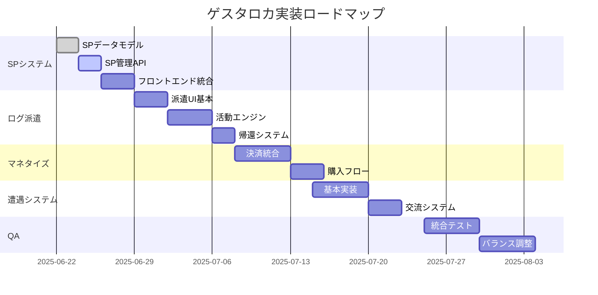

# 実装ロードマップ - ゲスタロカ

**作成日:** 2025/06/22  
**対象期間:** 2025/06/22 - 2025/08/31

## 概要

このドキュメントは、ログ派遣システムとSPシステムを中心とした今後2.5ヶ月の詳細な実装計画です。各タスクの技術的詳細、依存関係、完了基準を明確に定義します。

## フェーズ概要



## Week 15: SPシステム基盤（2025/06/22-28）

### 目標
SPシステムの完全な基盤実装とフロントエンド統合

### タスク詳細

#### 1. SPデータモデル実装（2日）
**ファイル**: `backend/app/models/sp.py`
```python
class PlayerSP(SQLModel, table=True):
    __tablename__ = "player_sp"
    
    character_id: str = Field(primary_key=True, foreign_key="characters.id")
    current_sp: int = Field(default=10)
    total_purchased_sp: int = Field(default=0)
    total_spent_sp: int = Field(default=0)
    last_natural_recovery: datetime
    
class SPTransaction(SQLModel, table=True):
    __tablename__ = "sp_transactions"
    
    id: str = Field(primary_key=True)
    character_id: str = Field(foreign_key="characters.id")
    amount: int  # 正: 獲得、負: 消費
    transaction_type: SPTransactionType
    description: str
    metadata: dict[str, Any] = Field(sa_column=Column(JSON))
    created_at: datetime
```

**完了基準**:
- [ ] マイグレーション作成・実行
- [ ] モデルのテスト作成
- [ ] リレーションシップ設定

#### 2. SP管理API（2日）
**ファイル**: `backend/app/api/api_v1/endpoints/sp.py`
```python
@router.get("/{character_id}/balance")
async def get_sp_balance(character_id: str) -> SPBalance

@router.post("/{character_id}/consume")
async def consume_sp(character_id: str, request: SPConsumeRequest) -> SPTransaction

@router.get("/{character_id}/transactions")
async def get_sp_history(character_id: str, limit: int = 50) -> List[SPTransaction]
```

**完了基準**:
- [ ] エンドポイント実装
- [ ] 適切なエラーハンドリング
- [ ] APIテスト完備

#### 3. フロントエンドSP表示（2日）
**コンポーネント**: `frontend/src/components/sp/SPDisplay.tsx`
- 現在のSP残高表示
- リアルタイム更新
- 不足時の視覚的フィードバック

**完了基準**:
- [ ] レスポンシブデザイン
- [ ] WebSocket連携
- [ ] アニメーション実装

#### 4. 自由行動SP消費（1日）
**統合ポイント**: `frontend/src/features/game/GameSession.tsx`
- 自由入力時のSP消費確認ダイアログ
- 消費量の動的計算
- 不足時の代替提案

**完了基準**:
- [ ] シームレスなUX
- [ ] 適切なフィードバック
- [ ] エラーハンドリング

## Week 16: ログ派遣基本機能（2025/06/29-07/05）

### 目標
ログ派遣の基本的なフローを実装

### タスク詳細

#### 1. 派遣UIデザイン・実装（3日）
**画面構成**:
- ログ選択画面
- 目的設定フォーム（5つのタイプ）
- 期間・地点選択
- SP消費確認
- 派遣実行

**完了基準**:
- [ ] 直感的なUI
- [ ] バリデーション完備
- [ ] プレビュー機能

#### 2. 派遣データモデル（1日）
```python
class LogDispatch(SQLModel, table=True):
    __tablename__ = "log_dispatches"
    
    id: str = Field(primary_key=True)
    completed_log_id: str = Field(foreign_key="completed_logs.id")
    dispatcher_id: str = Field(foreign_key="characters.id")
    objective_type: ObjectiveType
    objective_details: dict[str, Any]
    initial_location_id: str
    dispatch_duration_days: int
    sp_cost: int
    status: DispatchStatus
    dispatched_at: datetime
    expected_return_at: datetime
```

#### 3. 簡易活動シミュレーション（2日）
**基本ロジック**:
- 1日3-5回の主要行動
- 目的に応じた行動選択
- ランダムイベント発生
- 結果の記録

**完了基準**:
- [ ] 多様な活動パターン
- [ ] 予測可能な結果
- [ ] デバッグ機能

#### 4. 帰還処理（1日）
- 自動帰還トリガー
- 成果集計
- 報告書生成
- 報酬配布

## Week 17-18: マネタイズシステム（2025/07/06-19）

### 目標
SP購入システムの完全実装

### 主要タスク

#### 1. Stripe統合（5日）
- アカウント設定
- SDK統合
- Webhook実装
- テスト環境構築

#### 2. 購入フローUI（3日）
- 料金プラン表示
- 支払い方法選択
- 確認画面
- 領収書発行

#### 3. セキュリティ実装（2日）
- PCI DSS準拠
- 不正検知
- リファンド処理

## Week 19-20: 遭遇システム（2025/07/20-08/02）

### 目標
ログNPCとの遭遇を実現

### 主要タスク

#### 1. 遭遇エンジン（5日）
- セッション中のログ出現ロジック
- 遭遇条件の判定
- NPCとしての振る舞い実装

#### 2. 交流システム（3日）
- 対話UI
- 選択肢生成
- 結果の記録

#### 3. 相互記録（2日）
- 両プレイヤーへの通知
- 遭遇履歴の保存
- 関係性の追跡

## Week 21-22: 品質保証（2025/08/03-16）

### 目標
プロダクション品質の達成

### 主要タスク

#### 1. 統合テスト（5日）
- E2Eテストシナリオ作成
- 負荷テスト
- セキュリティテスト

#### 2. バランス調整（5日）
- SP消費量の最適化
- 報酬バランス
- 難易度カーブ

#### 3. ドキュメント整備（並行）
- APIドキュメント
- ユーザーガイド
- 運用マニュアル

## 技術的考慮事項

### パフォーマンス最適化
- ログ派遣のバッチ処理
- SP計算のキャッシュ
- 遭遇判定の効率化

### スケーラビリティ
- 派遣エンジンの水平スケール
- データベースのパーティショニング
- CDNの活用

### モニタリング
- SP経済の可視化
- 派遣成功率の追跡
- エラー率の監視

## リスクと対策

### 技術リスク
| リスク | 対策 |
|--------|------|
| 派遣処理の負荷 | Celeryによる非同期化 |
| 決済の複雑性 | Stripeの実績ある実装 |
| 遭遇の同期問題 | イベントソーシング |

### スケジュールリスク
| リスク | 対策 |
|--------|------|
| Stripe審査遅延 | 早期申請、代替決済 |
| バランス調整の長期化 | A/Bテスト自動化 |
| バグ修正の遅れ | 段階的リリース |

## 成功指標

### 各週の完了基準
- **Week 15**: SPでの行動が可能
- **Week 16**: ログ派遣が実行可能
- **Week 17-18**: SP購入が可能
- **Week 19-20**: 遭遇が発生
- **Week 21-22**: 安定稼働

### 品質指標
- テストカバレッジ: 80%以上
- レスポンスタイム: 200ms以下
- エラー率: 0.1%以下
- SP計算精度: 100%

## 日次タスク管理

### スクラムプロセス
- **デイリー**: 進捗確認、ブロッカー解決
- **週次**: スプリントレビュー、計画調整
- **隔週**: ステークホルダー報告

### ツール活用
- **タスク管理**: GitHub Issues/Projects
- **ドキュメント**: このリポジトリ
- **コミュニケーション**: Discord（将来）

## まとめ

このロードマップに従うことで、2.5ヶ月後にはSPシステムとログ派遣システムが完全に機能し、マネタイズ可能な状態でのリリースが可能となります。各週の目標は明確で達成可能であり、リスクも適切に管理されています。