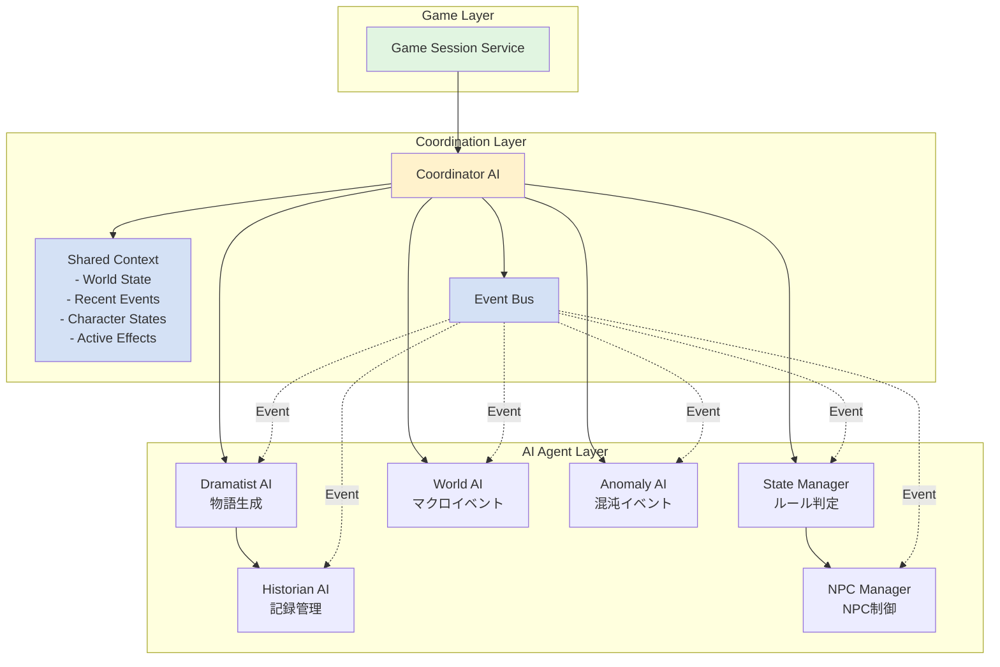
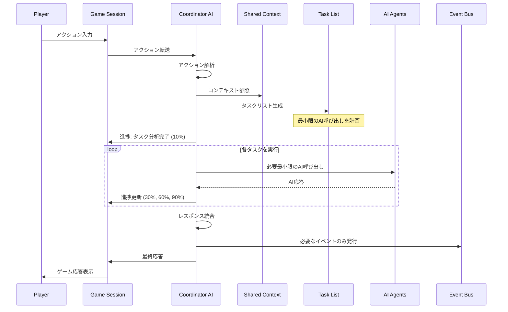
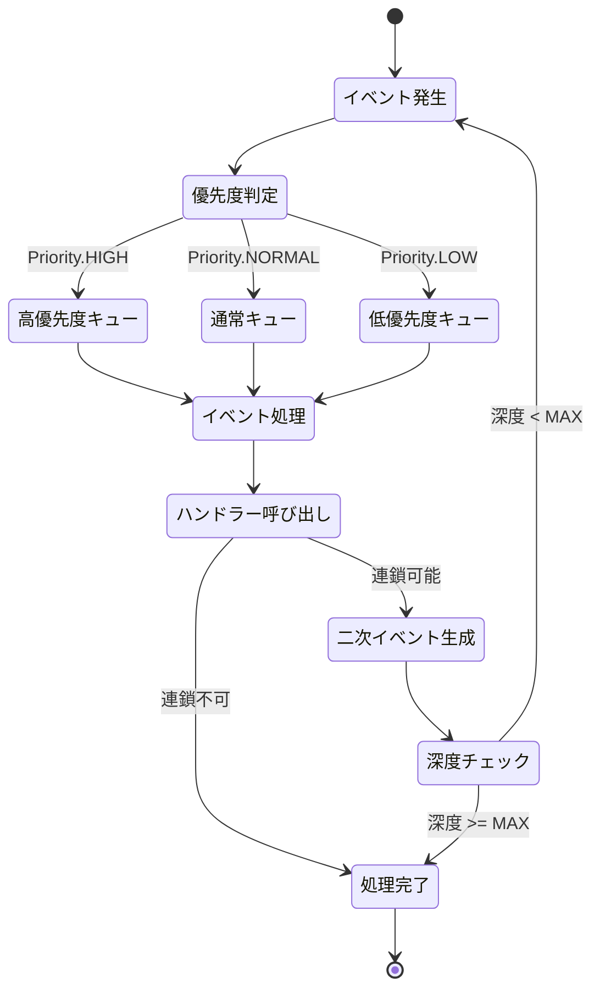

# AI協調アーキテクチャ仕様

**最終更新日:** 2025/06/16  
**親ドキュメント:** [AI協調動作プロトコル仕様書](./ai_coordination_protocol.md)

## 1. 全体構成

### 1.1 システムアーキテクチャ図



### 1.2 レイヤー構成

1. **ゲームレイヤー**: プレイヤーとの直接的なインターフェース
2. **コーディネーションレイヤー**: AI間の調整と情報共有
3. **AIエージェントレイヤー**: 専門的なAI処理

## 2. コンポーネント詳細

### 2.1 Coordinator AI
- すべてのAIエージェントの調整役
- プレイヤーアクションの解析と適切なAIへの振り分け
- **タスクリスト生成によるLLMリクエスト最適化**
- 各AIのレスポンスの収集と統合
- 最終的な応答の生成
- **進捗状況のリアルタイム配信**

### 2.2 Shared Context
- セッション内で共有される情報の管理
- リアルタイムでの状態同期
- イベント履歴の保持

### 2.3 Event Bus
- AI間のイベント通知システム
- 非同期メッセージング
- イベントの優先順位管理

## 3. 協調動作フロー

### 3.1 基本フロー（最適化版）



### 3.2 タスクリスト生成フェーズ

```python
@dataclass
class CoordinationTask:
    id: str
    name: str
    required_agents: List[str]
    coordination_type: CoordinationType  # SEQUENTIAL, PARALLEL, REACTIVE, CONSENSUS
    dependencies: List[str] = field(default_factory=list)
    estimated_time: float = 5.0
    progress_weight: float = 1.0

class TaskListGenerator:
    def generate_tasks(
        self,
        action: PlayerAction,
        shared_context: SharedContext
    ) -> List[CoordinationTask]:
        """アクションに基づいて最適なタスクリストを生成"""
        
        action_type = self.classify_action(action)
        tasks = []
        
        # アクションタイプに基づくタスク生成
        if action_type == ActionType.MOVEMENT:
            # 移動時は最小限のAI呼び出し
            if self._is_new_area(action, shared_context):
                tasks.append(CoordinationTask(
                    id="env_check",
                    name="環境確認",
                    required_agents=["world", "npc_manager"],
                    coordination_type=CoordinationType.PARALLEL
                ))
            
            tasks.append(CoordinationTask(
                id="describe",
                name="状況描写",
                required_agents=["dramatist"],
                coordination_type=CoordinationType.SEQUENTIAL,
                dependencies=["env_check"] if tasks else []
            ))
            
        elif action_type == ActionType.COMBAT:
            # 戦闘時は複数のAIが必要だが、順序を最適化
            tasks.extend([
                CoordinationTask(
                    id="combat_rules",
                    name="戦闘ルール適用",
                    required_agents=["state_manager"],
                    coordination_type=CoordinationType.SEQUENTIAL
                ),
                CoordinationTask(
                    id="combat_narrative",
                    name="戦闘描写",
                    required_agents=["dramatist"],
                    coordination_type=CoordinationType.SEQUENTIAL,
                    dependencies=["combat_rules"]
                )
            ])
            
        elif action_type == ActionType.QUEST_COMPLETE:
            # クエスト完了時はHistorianも含む
            tasks.extend([
                CoordinationTask(
                    id="quest_validation",
                    name="クエスト完了確認",
                    required_agents=["state_manager"],
                    coordination_type=CoordinationType.SEQUENTIAL
                ),
                CoordinationTask(
                    id="world_impact",
                    name="世界への影響",
                    required_agents=["world"],
                    coordination_type=CoordinationType.SEQUENTIAL
                ),
                CoordinationTask(
                    id="historical_record",
                    name="歴史記録",
                    required_agents=["historian"],
                    coordination_type=CoordinationType.PARALLEL
                ),
                CoordinationTask(
                    id="final_narrative",
                    name="完了描写",
                    required_agents=["dramatist"],
                    coordination_type=CoordinationType.SEQUENTIAL,
                    dependencies=["quest_validation", "world_impact"]
                )
            ])
        
        # 混沌チェックは確率的に追加
        if self._should_check_anomaly(shared_context):
            tasks.insert(0, CoordinationTask(
                id="anomaly_check",
                name="混沌チェック",
                required_agents=["anomaly"],
                coordination_type=CoordinationType.PARALLEL,
                estimated_time=3.0,
                progress_weight=0.5
            ))
        
        return self._optimize_task_order(tasks)
```

### 3.3 AI呼び出し最適化フェーズ

```python
class OptimizedCoordinator:
    async def execute_tasks(
        self,
        tasks: List[CoordinationTask],
        action_context: ActionContext
    ) -> List[AIResponse]:
        """タスクリストに基づいて最適化されたAI呼び出しを実行"""
        
        responses = {}
        total_weight = sum(task.progress_weight for task in tasks)
        current_progress = 0.0
        
        # 進捗通知
        await self.notify_progress("タスク分析完了", 10)
        
        # 依存関係を考慮したタスク実行
        for task in tasks:
            # 依存タスクの完了を待つ
            await self._wait_for_dependencies(task, responses)
            
            # タスクタイプに応じた実行
            if task.coordination_type == CoordinationType.PARALLEL:
                # 並列実行可能なタスクをグループ化
                parallel_group = self._get_parallel_group(task, tasks)
                group_responses = await self._execute_parallel(
                    parallel_group,
                    action_context
                )
                responses.update(group_responses)
                
            else:
                # 順次実行
                response = await self._execute_sequential(
                    task,
                    action_context,
                    responses
                )
                responses[task.id] = response
            
            # 進捗更新
            current_progress += task.progress_weight / total_weight * 80
            await self.notify_progress(
                f"{task.name}完了",
                10 + current_progress
            )
        
        await self.notify_progress("応答生成中", 95)
        return list(responses.values())
    
    async def _execute_parallel(
        self,
        tasks: List[CoordinationTask],
        context: ActionContext
    ) -> Dict[str, AIResponse]:
        """並列タスクをバッチ実行"""
        
        # 同じAIへの複数リクエストをマージ
        agent_requests = defaultdict(list)
        for task in tasks:
            for agent_name in task.required_agents:
                agent_requests[agent_name].append(task)
        
        # 各AIへの単一リクエストを生成
        async_tasks = []
        for agent_name, task_list in agent_requests.items():
            merged_context = self._merge_contexts(task_list, context)
            agent = self.agents[agent_name]
            async_tasks.append(
                self._call_agent_with_cache(agent, merged_context)
            )
        
        responses = await asyncio.gather(*async_tasks)
        return self._distribute_responses(responses, tasks)
```

### 3.4 レスポンス統合フェーズ

```python
# 各AIのレスポンスを統合
def integrate_responses(responses: List[AIResponse]) -> FinalResponse:
    final_response = FinalResponse()
    
    # 物語要素の統合
    final_response.narrative = merge_narratives(
        [r for r in responses if r.has_narrative]
    )
    
    # 状態変更の統合
    final_response.state_changes = merge_state_changes(
        [r for r in responses if r.has_state_changes]
    )
    
    # イベントの統合
    final_response.events = merge_events(
        [r for r in responses if r.has_events]
    )
    
    # 矛盾の解決
    final_response = resolve_conflicts(final_response)
    
    return final_response
```

## 4. データ構造定義

### 4.1 Shared Context

```python
@dataclass
class SharedContext:
    # セッション情報
    session_id: str
    turn_number: int
    
    # 世界状態
    world_state: WorldState
    weather: Weather
    time_of_day: TimeOfDay
    active_events: List[WorldEvent]
    
    # キャラクター状態
    player_state: CharacterState
    active_npcs: Dict[str, NPCState]
    
    # 履歴情報
    recent_actions: Deque[PlayerAction]  # 直近10アクション
    recent_events: Deque[GameEvent]      # 直近20イベント
    important_decisions: List[Decision]   # 重要な決定事項
    
    # AI決定履歴
    ai_decisions: Dict[str, List[AIDecision]]
    
    # 一時的な効果
    active_effects: List[TemporaryEffect]
    environmental_modifiers: Dict[str, float]
```

### 4.2 イベント定義

```python
@dataclass
class GameEvent:
    id: str = field(default_factory=lambda: str(uuid.uuid4()))
    type: EventType
    source: str  # 発生源（AI名またはシステム）
    timestamp: datetime = field(default_factory=datetime.utcnow)
    data: Dict[str, Any]
    priority: EventPriority = EventPriority.NORMAL
    
    # イベント連鎖情報
    parent_event_id: Optional[str] = None
    can_trigger_chain: bool = True
    max_chain_depth: int = 3

@dataclass
class AIResponse:
    agent_name: str
    narrative: Optional[str] = None
    choices: Optional[List[Choice]] = None
    state_changes: Optional[Dict[str, Any]] = None
    events: List[GameEvent] = field(default_factory=list)
    metadata: Dict[str, Any] = field(default_factory=dict)
```

### 4.3 イベントタイプ

```python
class EventType(Enum):
    # プレイヤー起因イベント
    PLAYER_ACTION = "player_action"
    PLAYER_LEVEL_UP = "player_level_up"
    PLAYER_DEATH = "player_death"
    
    # 世界イベント
    WORLD_EVENT = "world_event"
    WEATHER_CHANGE = "weather_change"
    TIME_PASSAGE = "time_passage"
    
    # NPCイベント
    NPC_SPAWN = "npc_spawn"
    NPC_INTERACTION = "npc_interaction"
    NPC_DEATH = "npc_death"
    
    # 混沌イベント
    ANOMALY_TRIGGER = "anomaly_trigger"
    REALITY_DISTORTION = "reality_distortion"
    
    # システムイベント
    QUEST_COMPLETE = "quest_complete"
    ACHIEVEMENT_UNLOCK = "achievement_unlock"
```

## 5. 更新メカニズム

### 5.1 SharedContextの更新

```python
class SharedContextManager:
    def __init__(self):
        self.context = SharedContext()
        self.update_lock = asyncio.Lock()
    
    async def update(self, updates: Dict[str, Any]):
        async with self.update_lock:
            for key, value in updates.items():
                if hasattr(self.context, key):
                    setattr(self.context, key, value)
            
            # 更新履歴の記録
            self._log_update(updates)
            
            # 関連AIへの通知
            await self._notify_context_change(updates)
```

### 5.2 イベント伝播メカニズム



```python
class EventChain:
    def __init__(self):
        self.event_queue = asyncio.Queue()
        self.handlers = defaultdict(list)
    
    def register_handler(self, event_type: EventType, agent: BaseAgent):
        self.handlers[event_type].append(agent)
    
    async def propagate_event(self, event: GameEvent):
        # 直接影響を受けるAIに通知
        primary_handlers = self.handlers[event.type]
        primary_responses = await self._notify_agents(primary_handlers, event)
        
        # 二次的な影響を処理
        secondary_events = self._extract_secondary_events(primary_responses)
        for secondary_event in secondary_events:
            await self.event_queue.put(secondary_event)
        
        # イベントキューの処理
        await self._process_event_queue()
```