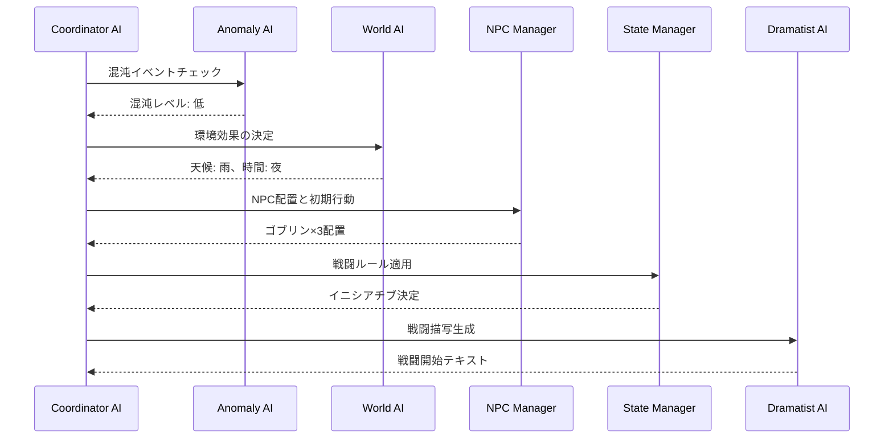
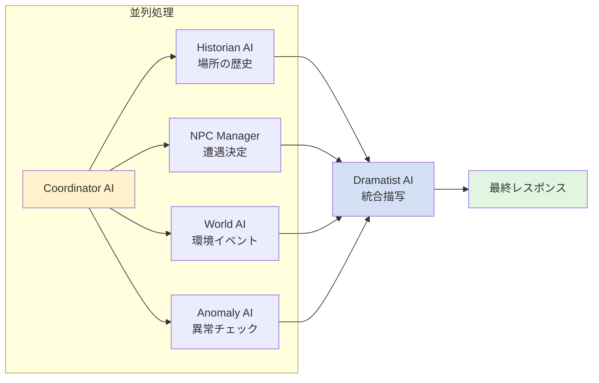
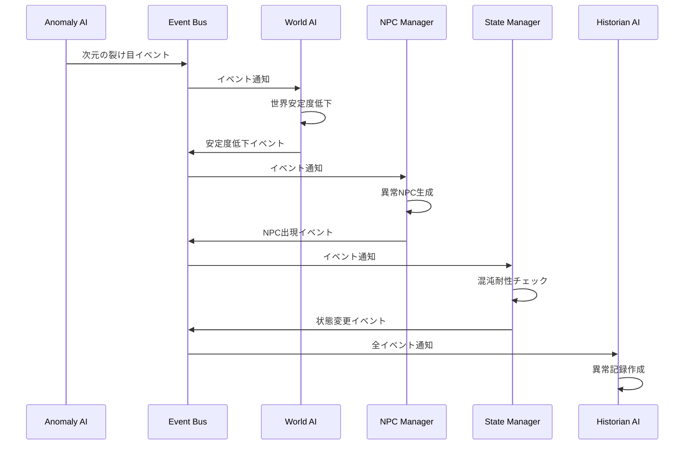
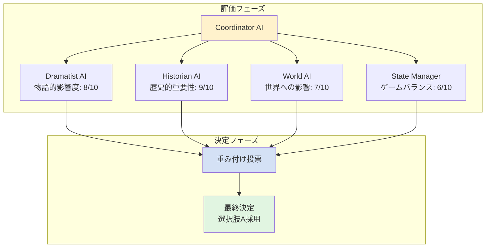

# AI協調パターンカタログ

**最終更新日:** 2025/06/16  
**親ドキュメント:** [AI協調動作プロトコル仕様書](./ai_coordination_protocol.md)

## 1. AIエージェント呼び出しガイドライン

### 1.1 各AIエージェントの呼び出しタイミング

#### 脚本家AI (Dramatist)
- **常に必要**: ほぼすべてのアクションで物語描写が必要
- **例外**: 純粋なシステムコマンド（ステータス確認など）

#### 状態管理AI (State Manager)
- **必要な場面**:
  - 戦闘行動
  - スキル使用
  - アイテム使用
  - パラメータに影響する行動
- **不要な場面**: 単純な移動、会話

#### 歴史家AI (Historian)
- **必要な場面**:
  - クエスト完了
  - 重要なNPCとの初回遭遇
  - ストーリーの節目
  - セッション終了時
- **頻度**: 10-20ターンに1回程度

#### NPC管理AI (NPC Manager)
- **必要な場面**:
  - 新しいエリアへの移動
  - NPCとの会話・戦闘
  - 時間経過によるNPC行動更新
- **不要な場面**: プレイヤーのみの行動

#### 世界の意識AI (The World)
- **必要な場面**:
  - 新しいエリアへの移動
  - 時間の大幅な経過
  - クエスト開始・完了
  - 世界イベントのトリガー
- **頻度**: 場面転換時のみ

#### 混沌AI (The Anomaly)
- **必要な場面**:
  - 確率的チェック（基本15%）
  - 特定の場所（混沌の影響が強い場所）
  - プレイヤーの混沌値が高い時
- **頻度**: 5-10ターンに1回のチェック

### 1.2 アクションタイプ別の最適な呼び出しパターン

| アクションタイプ | 必須AI | 条件付きAI | 説明 |
|--------------|--------|-----------|------|
| 移動 | Dramatist | World, NPC Manager | 新エリアの場合のみ条件付きAIを呼ぶ |
| 戦闘 | Dramatist, State Manager | Anomaly, NPC Manager | 混沌値による条件付き |
| 会話 | Dramatist, NPC Manager | Historian | 重要NPCの場合のみHistorian |
| アイテム使用 | Dramatist, State Manager | - | 状態変更を伴うため両方必須 |
| クエスト進行 | Dramatist, State Manager, World | Historian | 完了時のみHistorian |
| 探索 | Dramatist | World, NPC Manager, Anomaly | 場所と確率による |

## 2. シーケンシャル協調パターン

特定の順序でAIが処理を行うパターン。依存関係がある処理に使用。

### 2.1 戦闘開始時の協調

### 2.2 実装例

**handle_combat_start実装例**

戦闘開始時のシーケンシャル協調を実装する例。

タスクの実行順序：
1. **混沌チェック** (anomaly): オプショナルな混沌イベントチェック
2. **環境設定** (world): 天候や時間などの環境効果を決定
3. **NPC配置** (npc_manager): 敵NPCの初期配置
4. **戦闘ルール** (state_manager): イニシアチブ決定などのルール適用
5. **描写生成** (dramatist): 最終的な戦闘開始描写の生成

各タスクは依存関係に基づいて順番に実行され、CoordinationType.SEQUENTIALでシーケンシャル実行を保証。

## 3. パラレル協調パターン

複数のAIが並行して処理を行うパターン。独立した処理に使用。

### 3.1 探索行動時の協調

### 3.2 実装例

**handle_exploration実装例**

探索時のパラレル協調を実装する例。

処理フロー：
1. **並列実行フェーズ**：
   - 場所の歴史確認 (historian)
   - NPC遭遇判定 (npc_manager)
   - 環境イベント (world)
   - 異常イベント (anomaly)
   
   これらのタスクはCoordinationType.PARALLELで同時実行。

2. **結果統合フェーズ**：
   - 並列実行の結果をマージ
   - dramatistが全体を統合した描写を生成

3. **最終レスポンス**：
   - 並列実行結果と統合結果を組み合わせて返却

このパターンにより、独立した処理を並列化してパフォーマンスを向上。

## 4. リアクティブ協調パターン

あるAIの出力が他のAIのトリガーとなるパターン。イベント駆動型の処理に使用。

### 4.1 混沌イベント発生時の連鎖

### 4.2 実装例

**ReactiveCoordinatorクラス - リアクティブ協調実装**

イベント駆動型の協調パターンを実装するクラス。

**主要機能**：
- イベントタイプごとにハンドラーを定義
- ANOMALY_TRIGGERイベント：
  - world: 世界安定度の処理
  - npc_manager: 異常NPCの生成
  - state_manager: 混沌耐性チェック
- PLAYER_DEATHイベント：
  - historian: 死亡記録
  - world: 死亡数更新
  - anomaly: 死亡異常チェック

**process_reactive_eventメソッド**：
1. イベントタイプに対応するハンドラーを取得
2. 各ハンドラー用のCoordinationTaskを作成
3. 全タスクを並列実行
4. 二次イベントを抽出し、連鎖深度をチェックして再帰的に処理

このパターンにより、イベントの連鎖反応を効率的に管理。

## 5. コンセンサス協調パターン

複数のAIが合意形成を行うパターン。重要な決定に使用。

### 5.1 ストーリー分岐の決定

### 5.2 実装例

**ConsensusCoordinatorクラス - コンセンサス協調実装**

複数AIの合意形成による意思決定を実装するクラス。

**エージェントの重み付け**：
- dramatist: 0.3 (物語性重視)
- historian: 0.25 (歴史的整合性)
- world: 0.25 (世界への影響)
- state_manager: 0.2 (ゲームバランス)

**make_consensus_decisionメソッド**：
1. **評価収集フェーズ**：
   - 各AIエージェントに評価タスクを作成
   - CoordinationType.CONSENSUSで合意形成モードを指定
   - 全エージェントから並列で評価を収集

2. **重み付け投票フェーズ**：
   - 各エージェントの評価スコアに重みを乗算
   - 選択肢ごとに重み付けスコアを集計

3. **最終決定**：
   - 最高スコアの選択肢を選択
   - ConsensusResultに選択結果、スコア、評価、理由を含めて返却

このパターンにより、重要な決定で複数AIの観点をバランスよく統合。

## 6. ハイブリッド協調パターン

複数のパターンを組み合わせた複雑な協調。

### 6.1 クエスト完了時の処理

**handle_quest_completion実装例 - ハイブリッド協調**

クエスト完了時に複数の協調パターンを組み合わせた複雑な処理の実装例。

**処理フェーズ**：

1. **検証フェーズ (シーケンシャル)**：
   - state_managerがクエスト完了条件を検証
   - 検証失敗時は即座にエラーレスポンスを返却

2. **影響評価フェーズ (パラレル)**：
   - world: 世界への影響を評価
   - historian: 歴史記録を作成
   - npc_manager: NPCの反応を決定
   これらは独立しているため並列実行

3. **報酬決定フェーズ (コンセンサス)**：
   - 複数AIの合意形成によりクエスト報酬を決定
   - 影響評価結果をコンテキストに含める

4. **最終描写フェーズ (シーケンシャル)**：
   - dramatistが全ての結果を統合した最終描写を生成

5. **イベント発行フェーズ (リアクティブ)**：
   - クエスト完了イベントを発行し、連鎖反応をトリガー

この実装は、各協調パターンの強みを活かした複雑な処理の例。

## 7. パフォーマンス最適化のための協調パターン

### 7.1 キャッシュ活用パターン

**CachedCoordinatorクラス - キャッシュ活用パターン**

パフォーマンス最適化のためのキャッシュ活用を実装するクラス。

**キャッシュ構成**：
- response_cache: レスポンスキャッシュ（TTL: 300秒）
- pattern_cache: パターンキャッシュ（TTL: 600秒）

**execute_with_cacheメソッドの動作**：
1. タスクとコンテキストからパターンキーを生成
2. パターンキャッシュに類似パターンがあるか確認
3. キャッシュヒット時：
   - キャッシュされたレスポンスをコンテキストに合わせて軽量調整
   - LLM呼び出しを回避して高速化
4. キャッシュミス時：
   - 通常のタスク実行
   - 結果をパターンキャッシュに保存

このパターンにより、類似アクションのLLM呼び出しを大幅に削減。

### 7.2 プリフェッチパターン

**PrefetchCoordinatorクラス - プリフェッチパターン**

次のアクションを予測して先読みすることでレスポンスを高速化する実装。

**execute_with_prefetchメソッドの動作**：

1. **現在のアクション処理**：
   - 現在のアクションを非同期タスクとして開始

2. **次アクションの予測**：
   - 現在のアクションとコンテキストから次の可能性の高いアクションを予測
   - 予測精度の高い上位3つを選択

3. **バックグラウンドプリフェッチ**：
   - 予測されたアクションのレスポンスをバックグラウンドで先読み
   - 現在の処理に影響を与えないよう非同期実行

4. **結果の処理**：
   - 現在のアクション処理を優先して完了
   - プリフェッチ結果は2秒のタイムアウトでキャッシュに保存
   - プリフェッチ失敗を許容（メイン処理に影響なし）

このパターンにより、予測可能なユーザー行動に対してレスポンスを高速化。