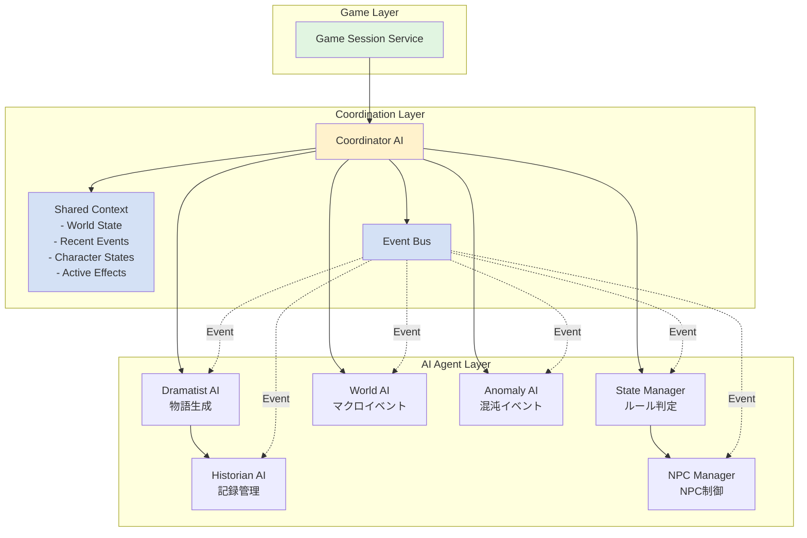
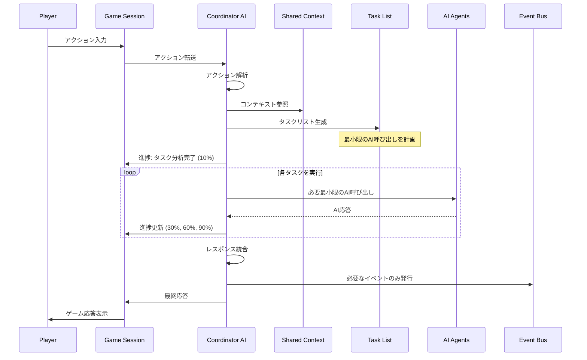
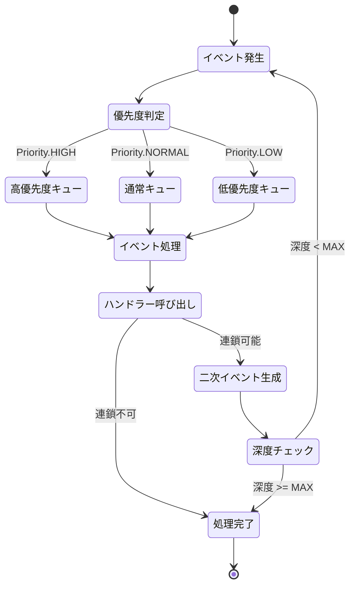
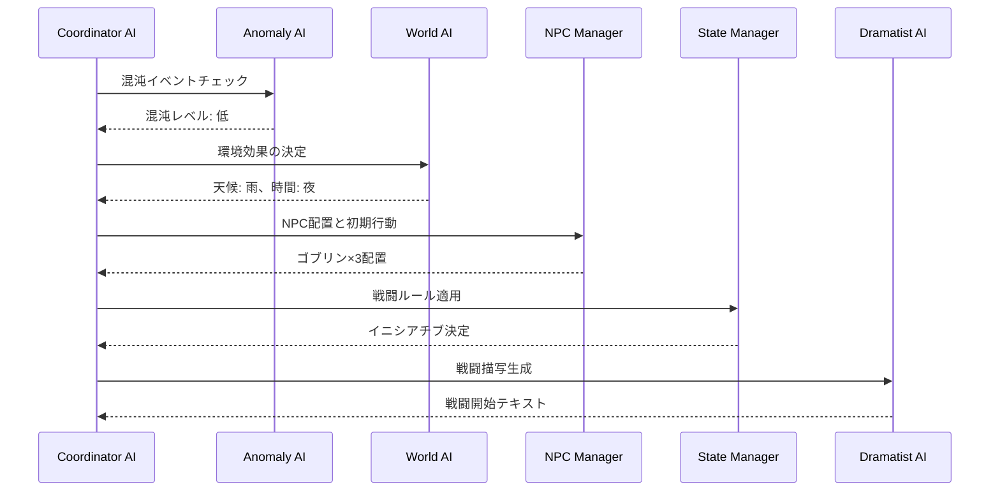
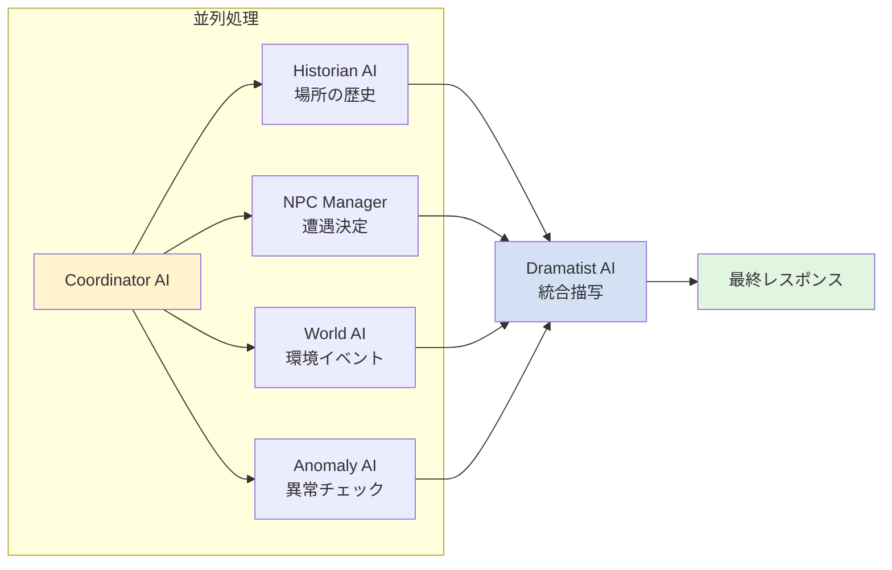
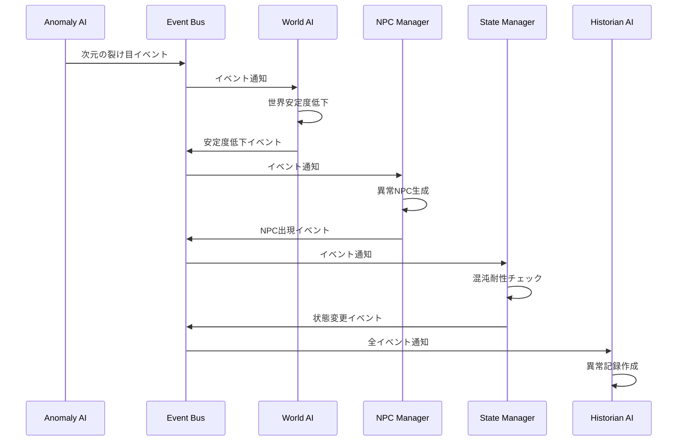
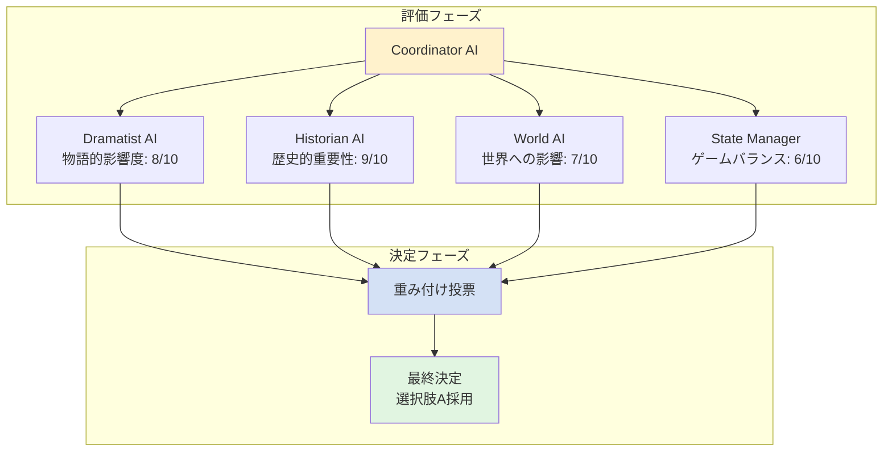

# AI協調動作プロトコル仕様書

**最終更新日:** 2025/06/16  
**バージョン:** 1.0.0  
**対象システム:** ゲスタロカ GM AI評議会

## 1. 概要

### 1.1 目的
GM AI評議会は6つの専門AIエージェントで構成されており、それぞれが独自の責務を持っています。本プロトコルは、これらのAIエージェントが協調して動作し、一貫性のある豊かなゲーム体験を提供するための仕組みを定義します。

### 1.2 GM AI評議会メンバー
1. **脚本家AI (Dramatist)** - 物語生成とテキスト創作
2. **状態管理AI (State Manager)** - ルール判定とパラメータ管理
3. **歴史家AI (Historian)** - 記録管理と歴史編纂
4. **NPC管理AI (NPC Manager)** - NPC生成と行動制御
5. **世界の意識AI (The World)** - マクロイベント管理
6. **混沌AI (The Anomaly)** - 予測不能イベント生成

### 1.3 協調動作の原則
- **非同期協調**: 各AIは独立して動作しつつ、必要に応じて他のAIと協調
- **情報共有**: SharedContextを通じて必要な情報を共有
- **優先順位**: 緊急度と重要度に基づいて処理順序を決定
- **一貫性**: 複数のAIの出力を統合して矛盾のない結果を生成

## 2. アーキテクチャ

### 2.1 全体構成



### 2.2 コンポーネント説明

#### 2.2.1 Coordinator AI
- すべてのAIエージェントの調整役
- プレイヤーアクションの解析と適切なAIへの振り分け
- **タスクリスト生成によるLLMリクエスト最適化**
- 各AIのレスポンスの収集と統合
- 最終的な応答の生成
- **進捗状況のリアルタイム配信**

#### 2.2.2 Shared Context
- セッション内で共有される情報の管理
- リアルタイムでの状態同期
- イベント履歴の保持

#### 2.2.3 Event Bus
- AI間のイベント通知システム
- 非同期メッセージング
- イベントの優先順位管理

## 3. 協調動作フロー

### 3.1 基本フロー（最適化版）



### 3.2 詳細な処理フロー

#### 3.2.1 タスクリスト生成フェーズ
```python
@dataclass
class CoordinationTask:
    id: str
    name: str
    required_agents: List[str]
    coordination_type: CoordinationType  # SEQUENTIAL, PARALLEL, REACTIVE, CONSENSUS
    dependencies: List[str] = field(default_factory=list)
    estimated_time: float = 5.0
    progress_weight: float = 1.0

class TaskListGenerator:
    def generate_tasks(
        self,
        action: PlayerAction,
        shared_context: SharedContext
    ) -> List[CoordinationTask]:
        """アクションに基づいて最適なタスクリストを生成"""
        
        action_type = self.classify_action(action)
        tasks = []
        
        # アクションタイプに基づくタスク生成
        if action_type == ActionType.MOVEMENT:
            # 移動時は最小限のAI呼び出し
            if self._is_new_area(action, shared_context):
                tasks.append(CoordinationTask(
                    id="env_check",
                    name="環境確認",
                    required_agents=["world", "npc_manager"],
                    coordination_type=CoordinationType.PARALLEL
                ))
            
            tasks.append(CoordinationTask(
                id="describe",
                name="状況描写",
                required_agents=["dramatist"],
                coordination_type=CoordinationType.SEQUENTIAL,
                dependencies=["env_check"] if tasks else []
            ))
            
        elif action_type == ActionType.COMBAT:
            # 戦闘時は複数のAIが必要だが、順序を最適化
            tasks.extend([
                CoordinationTask(
                    id="combat_rules",
                    name="戦闘ルール適用",
                    required_agents=["state_manager"],
                    coordination_type=CoordinationType.SEQUENTIAL
                ),
                CoordinationTask(
                    id="combat_narrative",
                    name="戦闘描写",
                    required_agents=["dramatist"],
                    coordination_type=CoordinationType.SEQUENTIAL,
                    dependencies=["combat_rules"]
                )
            ])
            
        elif action_type == ActionType.QUEST_COMPLETE:
            # クエスト完了時はHistorianも含む
            tasks.extend([
                CoordinationTask(
                    id="quest_validation",
                    name="クエスト完了確認",
                    required_agents=["state_manager"],
                    coordination_type=CoordinationType.SEQUENTIAL
                ),
                CoordinationTask(
                    id="world_impact",
                    name="世界への影響",
                    required_agents=["world"],
                    coordination_type=CoordinationType.SEQUENTIAL
                ),
                CoordinationTask(
                    id="historical_record",
                    name="歴史記録",
                    required_agents=["historian"],
                    coordination_type=CoordinationType.PARALLEL
                ),
                CoordinationTask(
                    id="final_narrative",
                    name="完了描写",
                    required_agents=["dramatist"],
                    coordination_type=CoordinationType.SEQUENTIAL,
                    dependencies=["quest_validation", "world_impact"]
                )
            ])
        
        # 混沌チェックは確率的に追加
        if self._should_check_anomaly(shared_context):
            tasks.insert(0, CoordinationTask(
                id="anomaly_check",
                name="混沌チェック",
                required_agents=["anomaly"],
                coordination_type=CoordinationType.PARALLEL,
                estimated_time=3.0,
                progress_weight=0.5
            ))
        
        return self._optimize_task_order(tasks)
```

#### 3.2.2 AI呼び出し最適化フェーズ
```python
class OptimizedCoordinator:
    async def execute_tasks(
        self,
        tasks: List[CoordinationTask],
        action_context: ActionContext
    ) -> List[AIResponse]:
        """タスクリストに基づいて最適化されたAI呼び出しを実行"""
        
        responses = {}
        total_weight = sum(task.progress_weight for task in tasks)
        current_progress = 0.0
        
        # 進捗通知
        await self.notify_progress("タスク分析完了", 10)
        
        # 依存関係を考慮したタスク実行
        for task in tasks:
            # 依存タスクの完了を待つ
            await self._wait_for_dependencies(task, responses)
            
            # タスクタイプに応じた実行
            if task.coordination_type == CoordinationType.PARALLEL:
                # 並列実行可能なタスクをグループ化
                parallel_group = self._get_parallel_group(task, tasks)
                group_responses = await self._execute_parallel(
                    parallel_group,
                    action_context
                )
                responses.update(group_responses)
                
            else:
                # 順次実行
                response = await self._execute_sequential(
                    task,
                    action_context,
                    responses
                )
                responses[task.id] = response
            
            # 進捗更新
            current_progress += task.progress_weight / total_weight * 80
            await self.notify_progress(
                f"{task.name}完了",
                10 + current_progress
            )
        
        await self.notify_progress("応答生成中", 95)
        return list(responses.values())
    
    async def _execute_parallel(
        self,
        tasks: List[CoordinationTask],
        context: ActionContext
    ) -> Dict[str, AIResponse]:
        """並列タスクをバッチ実行"""
        
        # 同じAIへの複数リクエストをマージ
        agent_requests = defaultdict(list)
        for task in tasks:
            for agent_name in task.required_agents:
                agent_requests[agent_name].append(task)
        
        # 各AIへの単一リクエストを生成
        async_tasks = []
        for agent_name, task_list in agent_requests.items():
            merged_context = self._merge_contexts(task_list, context)
            agent = self.agents[agent_name]
            async_tasks.append(
                self._call_agent_with_cache(agent, merged_context)
            )
        
        responses = await asyncio.gather(*async_tasks)
        return self._distribute_responses(responses, tasks)
```

#### 3.2.3 レスポンス統合フェーズ
```python
# 各AIのレスポンスを統合
def integrate_responses(responses: List[AIResponse]) -> FinalResponse:
    final_response = FinalResponse()
    
    # 物語要素の統合
    final_response.narrative = merge_narratives(
        [r for r in responses if r.has_narrative]
    )
    
    # 状態変更の統合
    final_response.state_changes = merge_state_changes(
        [r for r in responses if r.has_state_changes]
    )
    
    # イベントの統合
    final_response.events = merge_events(
        [r for r in responses if r.has_events]
    )
    
    # 矛盾の解決
    final_response = resolve_conflicts(final_response)
    
    return final_response
```

### 3.3 イベント連鎖システム

#### 3.3.1 イベントタイプ
```python
class EventType(Enum):
    # プレイヤー起因イベント
    PLAYER_ACTION = "player_action"
    PLAYER_LEVEL_UP = "player_level_up"
    PLAYER_DEATH = "player_death"
    
    # 世界イベント
    WORLD_EVENT = "world_event"
    WEATHER_CHANGE = "weather_change"
    TIME_PASSAGE = "time_passage"
    
    # NPCイベント
    NPC_SPAWN = "npc_spawn"
    NPC_INTERACTION = "npc_interaction"
    NPC_DEATH = "npc_death"
    
    # 混沌イベント
    ANOMALY_TRIGGER = "anomaly_trigger"
    REALITY_DISTORTION = "reality_distortion"
    
    # システムイベント
    QUEST_COMPLETE = "quest_complete"
    ACHIEVEMENT_UNLOCK = "achievement_unlock"
```

#### 3.3.2 イベント伝播メカニズム



```python
class EventChain:
    def __init__(self):
        self.event_queue = asyncio.Queue()
        self.handlers = defaultdict(list)
    
    def register_handler(self, event_type: EventType, agent: BaseAgent):
        self.handlers[event_type].append(agent)
    
    async def propagate_event(self, event: GameEvent):
        # 直接影響を受けるAIに通知
        primary_handlers = self.handlers[event.type]
        primary_responses = await self._notify_agents(primary_handlers, event)
        
        # 二次的な影響を処理
        secondary_events = self._extract_secondary_events(primary_responses)
        for secondary_event in secondary_events:
            await self.event_queue.put(secondary_event)
        
        # イベントキューの処理
        await self._process_event_queue()
```

## 4. Shared Context仕様

### 4.1 データ構造
```python
@dataclass
class SharedContext:
    # セッション情報
    session_id: str
    turn_number: int
    
    # 世界状態
    world_state: WorldState
    weather: Weather
    time_of_day: TimeOfDay
    active_events: List[WorldEvent]
    
    # キャラクター状態
    player_state: CharacterState
    active_npcs: Dict[str, NPCState]
    
    # 履歴情報
    recent_actions: Deque[PlayerAction]  # 直近10アクション
    recent_events: Deque[GameEvent]      # 直近20イベント
    important_decisions: List[Decision]   # 重要な決定事項
    
    # AI決定履歴
    ai_decisions: Dict[str, List[AIDecision]]
    
    # 一時的な効果
    active_effects: List[TemporaryEffect]
    environmental_modifiers: Dict[str, float]
```

### 4.2 更新メカニズム
```python
class SharedContextManager:
    def __init__(self):
        self.context = SharedContext()
        self.update_lock = asyncio.Lock()
    
    async def update(self, updates: Dict[str, Any]):
        async with self.update_lock:
            for key, value in updates.items():
                if hasattr(self.context, key):
                    setattr(self.context, key, value)
            
            # 更新履歴の記録
            self._log_update(updates)
            
            # 関連AIへの通知
            await self._notify_context_change(updates)
```

## 5. AI間の協調パターン（最適化版）

### 5.0 AIエージェント呼び出しガイドライン

#### 5.0.1 各AIエージェントの呼び出しタイミング

**脚本家AI (Dramatist)**
- **常に必要**: ほぼすべてのアクションで物語描写が必要
- **例外**: 純粋なシステムコマンド（ステータス確認など）

**状態管理AI (State Manager)**
- **必要な場面**:
  - 戦闘行動
  - スキル使用
  - アイテム使用
  - パラメータに影響する行動
- **不要な場面**: 単純な移動、会話

**歴史家AI (Historian)**
- **必要な場面**:
  - クエスト完了
  - 重要なNPCとの初回遭遇
  - ストーリーの節目
  - セッション終了時
- **頻度**: 10-20ターンに1回程度

**NPC管理AI (NPC Manager)**
- **必要な場面**:
  - 新しいエリアへの移動
  - NPCとの会話・戦闘
  - 時間経過によるNPC行動更新
- **不要な場面**: プレイヤーのみの行動

**世界の意識AI (The World)**
- **必要な場面**:
  - 新しいエリアへの移動
  - 時間の大幅な経過
  - クエスト開始・完了
  - 世界イベントのトリガー
- **頻度**: 場面転換時のみ

**混沌AI (The Anomaly)**
- **必要な場面**:
  - 確率的チェック（基本15%）
  - 特定の場所（混沌の影響が強い場所）
  - プレイヤーの混沌値が高い時
- **頻度**: 5-10ターンに1回のチェック

### 5.1 シーケンシャル協調
特定の順序でAIが処理を行うパターン

**例: 戦闘開始時**



### 5.2 パラレル協調
複数のAIが並行して処理を行うパターン

**例: 探索行動時**



### 5.3 リアクティブ協調
あるAIの出力が他のAIのトリガーとなるパターン

**例: 混沌イベント発生時**



### 5.4 コンセンサス協調
複数のAIが合意形成を行うパターン

**例: 重要なストーリー分岐**



## 6. 実装詳細

### 6.1 Coordinator AIクラス（最適化版）
```python
class CoordinatorAI:
    def __init__(self, agents: Dict[str, BaseAgent]):
        self.agents = agents
        self.shared_context = SharedContextManager()
        self.event_chain = EventChain()
        self.task_generator = TaskListGenerator()
        self.response_cache = ResponseCache()
        
    async def process_action(
        self,
        action: PlayerAction,
        session: GameSession
    ) -> GameResponse:
        # 1. アクション解析
        context = self.analyze_action(action)
        
        # 2. Shared Context更新
        await self.shared_context.update({
            'recent_actions': action,
            'turn_number': session.turn_number
        })
        
        # 3. タスクリスト生成（最適化の核心）
        tasks = self.task_generator.generate_tasks(
            action,
            self.shared_context.context
        )
        
        # 4. 進捗通知開始
        await self.notify_progress("処理開始", 0)
        await self.notify_progress(
            f"タスク数: {len(tasks)}, 予想時間: {self._estimate_time(tasks)}秒",
            5
        )
        
        # 5. タスク実行（最適化された呼び出し）
        responses = await self.execute_tasks(tasks, context)
        
        # 6. レスポンス統合
        integrated = self.integrate_responses(responses)
        
        # 7. 必要最小限のイベント処理
        if integrated.events:
            await self.process_event_chain(integrated.events)
        
        # 8. 最終レスポンス生成
        await self.notify_progress("完了", 100)
        return self.generate_final_response(integrated)
    
    def _estimate_time(self, tasks: List[CoordinationTask]) -> float:
        """タスクリストから推定実行時間を計算"""
        parallel_time = 0
        sequential_time = 0
        
        for task in tasks:
            if task.coordination_type == CoordinationType.PARALLEL:
                parallel_time = max(parallel_time, task.estimated_time)
            else:
                sequential_time += task.estimated_time
        
        return parallel_time + sequential_time
```

### 6.2 BaseAgentの拡張
```python
class BaseAgent(ABC):
    def __init__(self, name: str):
        self.name = name
        self.gemini_client = GeminiClient()
        self.prompt_manager = PromptManager()
    
    @abstractmethod
    async def process(
        self,
        context: ActionContext,
        shared_context: SharedContext
    ) -> AIResponse:
        """各AIエージェントが実装する処理メソッド"""
        pass
    
    async def notify_event(self, event: GameEvent):
        """他のAIからのイベント通知を受信"""
        if self.should_react_to(event):
            response = await self.react_to_event(event)
            return response
        return None
    
    @abstractmethod
    def should_react_to(self, event: GameEvent) -> bool:
        """このイベントに反応すべきかを判定"""
        pass
    
    @abstractmethod
    async def react_to_event(self, event: GameEvent) -> Optional[AIResponse]:
        """イベントへの反応を生成"""
        pass
```

### 6.3 イベント定義
```python
@dataclass
class GameEvent:
    id: str = field(default_factory=lambda: str(uuid.uuid4()))
    type: EventType
    source: str  # 発生源（AI名またはシステム）
    timestamp: datetime = field(default_factory=datetime.utcnow)
    data: Dict[str, Any]
    priority: EventPriority = EventPriority.NORMAL
    
    # イベント連鎖情報
    parent_event_id: Optional[str] = None
    can_trigger_chain: bool = True
    max_chain_depth: int = 3

@dataclass
class AIResponse:
    agent_name: str
    narrative: Optional[str] = None
    choices: Optional[List[Choice]] = None
    state_changes: Optional[Dict[str, Any]] = None
    events: List[GameEvent] = field(default_factory=list)
    metadata: Dict[str, Any] = field(default_factory=dict)
```

## 7. エラーハンドリングと信頼性

### 7.1 タイムアウト処理
```python
class CoordinatorAI:
    async def invoke_agents_with_timeout(
        self,
        agents: List[BaseAgent],
        context: ActionContext,
        timeout: float = 30.0
    ) -> List[AIResponse]:
        results = []
        
        for agent in agents:
            try:
                response = await asyncio.wait_for(
                    agent.process(context, self.shared_context.context),
                    timeout=timeout
                )
                results.append(response)
            except asyncio.TimeoutError:
                # デフォルトレスポンスを使用
                results.append(self.get_default_response(agent))
                logger.warning(f"{agent.name} timed out")
        
        return results
```

### 7.2 フォールバック戦略
```python
def get_fallback_response(self, failed_agent: str) -> AIResponse:
    """AIが失敗した場合のフォールバック応答"""
    fallback_strategies = {
        "dramatist": self.get_generic_narrative,
        "state_manager": self.get_default_state,
        "world": self.get_stable_world_state,
        "anomaly": self.get_no_anomaly_response,
        "historian": self.get_empty_history,
        "npc_manager": self.get_no_npc_response
    }
    
    return fallback_strategies.get(
        failed_agent,
        self.get_minimal_response
    )()
```

### 7.3 一貫性チェック
```python
def validate_integrated_response(self, response: FinalResponse) -> bool:
    """統合されたレスポンスの一貫性をチェック"""
    checks = [
        self.check_state_consistency(response.state_changes),
        self.check_narrative_coherence(response.narrative),
        self.check_event_validity(response.events),
        self.check_choice_availability(response.choices)
    ]
    
    return all(checks)
```

## 8. パフォーマンス最適化

### 8.1 キャッシング戦略
```python
class ResponseCache:
    def __init__(self, ttl: int = 300):
        self.cache = {}
        self.ttl = ttl
    
    def get_cached_response(
        self,
        agent: str,
        context_hash: str
    ) -> Optional[AIResponse]:
        key = f"{agent}:{context_hash}"
        if key in self.cache:
            response, timestamp = self.cache[key]
            if time.time() - timestamp < self.ttl:
                return response
        return None
```

### 8.2 優先順位付きキュー
```python
class PriorityEventQueue:
    def __init__(self):
        self.queue = []
        self.counter = 0
    
    async def put(self, event: GameEvent):
        # 優先順位、タイムスタンプ、カウンターでソート
        priority_tuple = (
            -event.priority.value,  # 高優先度が先
            event.timestamp,
            self.counter
        )
        heapq.heappush(self.queue, (priority_tuple, event))
        self.counter += 1
```

## 9. テスト戦略

### 9.1 単体テスト
- 各AIエージェントの独立したテスト
- Coordinator AIの各メソッドのテスト
- SharedContextの更新・同期テスト

### 9.2 統合テスト
- 複数AIの協調動作テスト
- イベント連鎖のテスト
- エラー時のフォールバックテスト

### 9.3 シナリオテスト
- 典型的なゲームシナリオでの動作確認
- 極端な状況での安定性テスト
- パフォーマンステスト

## 10. 今後の拡張

### 10.1 機械学習統合
- プレイヤー行動パターンの学習
- AI協調パターンの最適化
- 動的な優先順位調整

### 10.2 分散処理
- AI処理の分散化
- マイクロサービス化の検討
- スケーラビリティの向上

### 10.3 リアルタイム最適化
- レスポンス時間の動的調整
- 品質とスピードのバランス調整
- プレイヤー満足度の最大化

## 11. 進捗通知システム

### 11.1 進捗表示の目的
- プレイヤーの待ち時間に対する不安を軽減
- 処理の透明性を確保
- システムの動作状況を可視化

### 11.2 進捗通知の実装
```python
class ProgressNotifier:
    def __init__(self, websocket_manager):
        self.websocket = websocket_manager
        self.current_progress = 0
        self.current_task = ""
        
    async def notify_progress(
        self,
        message: str,
        percentage: int,
        details: Optional[Dict] = None
    ):
        """プレイヤーに進捗を通知"""
        progress_data = {
            "type": "ai_processing_progress",
            "percentage": percentage,
            "message": message,
            "timestamp": datetime.utcnow().isoformat(),
            "details": details or {}
        }
        
        # WebSocket経由で即座に送信
        await self.websocket.emit_to_session(
            self.session_id,
            "game_progress",
            progress_data
        )
        
        # ログ記録
        logger.info(
            f"Progress: {percentage}% - {message}",
            extra={"session_id": self.session_id}
        )
```

### 11.3 進捗表示の例
```typescript
// フロントエンドでの進捗表示
interface ProgressUpdate {
    type: 'ai_processing_progress';
    percentage: number;
    message: string;
    timestamp: string;
    details?: {
        taskCount?: number;
        currentTask?: string;
        estimatedTime?: number;
    };
}

// 進捗表示コンポーネント
const AIProgressIndicator: React.FC = () => {
    const [progress, setProgress] = useState<ProgressUpdate | null>(null);
    
    useEffect(() => {
        const handler = (update: ProgressUpdate) => {
            setProgress(update);
        };
        
        socket.on('game_progress', handler);
        return () => socket.off('game_progress', handler);
    }, []);
    
    if (!progress) return null;
    
    return (
        <div className="ai-progress">
            <div className="progress-bar">
                <div 
                    className="progress-fill"
                    style={{ width: `${progress.percentage}%` }}
                />
            </div>
            <p className="progress-message">{progress.message}</p>
            {progress.details?.estimatedTime && (
                <p className="estimated-time">
                    予想残り時間: {progress.details.estimatedTime}秒
                </p>
            )}
        </div>
    );
};
```

## 12. まとめ

本AI協調動作プロトコルは、6つのGM AIエージェントが効果的に連携し、プレイヤーに一貫性のある豊かなゲーム体験を提供するための基盤となります。

主要な特徴：
- **LLMリクエスト最適化**: タスクリスト生成による最小限の呼び出し
- **リアルタイム進捗通知**: プレイヤー体験の向上
- **非同期並列処理**: 高速なレスポンス生成
- **イベント駆動**: 動的で予測不能な展開
- **堅牢性**: エラー時のフォールバック
- **拡張性**: 新しいAIエージェントの追加が容易

最適化のポイント：
1. **アクションタイプに基づく最小限のAI呼び出し**
2. **並列実行可能なタスクのグループ化**
3. **キャッシングによる重複リクエストの削減**
4. **進捗通知によるユーザー体験の改善**

このプロトコルに基づいて実装を進めることで、ゲスタロカの核となる「動的な物語生成」を効率的に実現します。