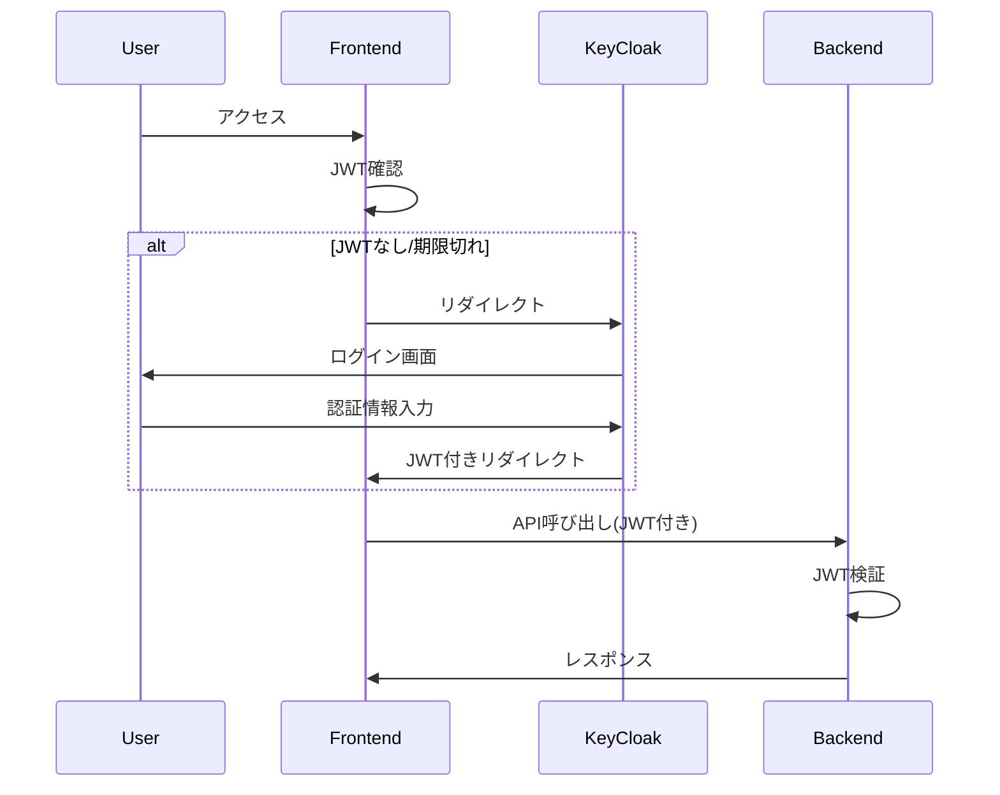

# 実装パターン - ログバース (Logverse)

このファイルには、確立された実装パターンとベストプラクティスが記載されています。

## 認証フロー



## WebSocket通信

**Socket.IO選定理由:**
- 自動再接続
- ルーム機能
- イベントベースの通信

**実装パターン:**
```python
# サーバー側
@sio.on('player_action')
async def handle_player_action(sid, data):
    # 認証確認
    session = await get_session(sid)
    if not session:
        return {'error': 'Unauthorized'}
    
    # アクション処理
    result = await game_engine.process_action(
        session.player_id, 
        data
    )
    
    # 同じ場所にいる他プレイヤーに通知
    await sio.emit(
        'world_update',
        result,
        room=f"location:{result.location_id}"
    )
```

## AI統合パターン

**プロンプトエンジニアリング:**
```python
# システムプロンプトの構造化
DRAMATIST_SYSTEM_PROMPT = """
あなたは階層世界『レーシュ』の脚本家AIです。
プレイヤーの行動に応じて、以下の原則に従って物語を生成してください：

1. 世界観の一貫性を保つ
2. プレイヤーの自由度を尊重する
3. 他のプレイヤーやNPCとの相互作用を促進する

現在の状況:
{context}

プレイヤーの行動:
{action}
"""

# コンテキスト注入
def build_context(player_id: str) -> dict:
    return {
        "location": get_player_location(player_id),
        "nearby_entities": get_nearby_entities(player_id),
        "recent_events": get_recent_events(player_id),
        "player_stats": get_player_stats(player_id)
    }
```

## エラーハンドリング

**統一エラーレスポンス:**
```python
class ErrorResponse(BaseModel):
    error: str
    error_code: str
    details: Optional[dict] = None
    timestamp: datetime = Field(default_factory=datetime.utcnow)

@app.exception_handler(GameError)
async def game_error_handler(request: Request, exc: GameError):
    return JSONResponse(
        status_code=400,
        content=ErrorResponse(
            error=str(exc),
            error_code=exc.error_code,
            details=exc.details
        ).dict()
    )
```

## パフォーマンス最適化

**データベースクエリ最適化:**
```python
# N+1問題の回避
# 悪い例
players = session.query(Player).all()
for player in players:
    skills = player.skills  # 各プレイヤーごとにクエリ発生

# 良い例
players = session.query(Player).options(
    joinedload(Player.skills)
).all()
```

**非同期処理の活用:**
```python
# 並行処理でパフォーマンス向上
async def get_game_context(player_id: str):
    # 複数のデータソースから並行取得
    tasks = [
        get_player_data(player_id),
        get_location_data(player_id),
        get_nearby_npcs(player_id),
        get_recent_logs(player_id)
    ]
    
    results = await asyncio.gather(*tasks)
    return build_context(*results)
```

## サービス層分離パターン

```python
class GameSessionService:
    def __init__(self, db: Session):
        self.db = db
    
    def create_session(self, user_id: str, session_data: GameSessionCreate) -> GameSessionResponse:
        # 既存アクティブセッション非アクティブ化
        # 新セッション作成
        # 初期シーン設定
        # レスポンス生成
```

## React Query + Zustand統合パターン

```typescript
export const useCreateGameSession = () => {
  const { setActiveSession } = useGameSessionStore()
  
  return useMutation<GameSession, Error, GameSessionCreate>({
    mutationFn: (sessionData) => apiClient.createGameSession(sessionData),
    onSuccess: (newSession) => {
      queryClient.invalidateQueries({ queryKey: ['gameSessions'] })
      setActiveSession(newSession) // ストア更新
    },
  })
}
```

## 型安全なAPIクライアント統合

```typescript
// snake_case ↔ camelCase変換統合
async createGameSession(sessionData: GameSessionCreate): Promise<GameSession> {
  const snakeData = camelToSnakeObject(sessionData)
  const data = await this.request<any>('/game/sessions', {
    method: 'POST',
    body: JSON.stringify(snakeData),
  })
  return snakeToCamelObject<GameSession>(data)
}
```

## WebSocket実装パターン（準備完了）

**Socket.IO選定理由:**
- 自動再接続機能
- ルーム機能によるプレイヤーグルーピング
- イベントベース通信

**実装パターン:**
```python
# サーバー側（app/websocket.py）
import socketio
from fastapi_socketio import SocketManager

sio = SocketManager(app=app)

@sio.on('player_action')
async def handle_player_action(sid, data):
    # JWT認証確認
    session = await get_session(sid)
    if not session:
        return {'error': 'Unauthorized'}
    
    # アクション処理をCeleryタスクキューに
    task = process_player_action.delay(
        session.player_id, 
        data
    )
    
    # 同じロケーションの他プレイヤーに通知
    await sio.emit(
        'world_update',
        {'player_id': session.player_id, 'action': data},
        room=f"location:{data.location_id}"
    )

# フロントエンド側（src/services/websocket.ts）
import { io, Socket } from 'socket.io-client'

class GameSocket {
  private socket: Socket
  
  connect(token: string) {
    this.socket = io(WS_URL, {
      auth: { token },
      transports: ['websocket']
    })
    
    this.socket.on('world_update', this.handleWorldUpdate)
    this.socket.on('story_response', this.handleStoryResponse)
  }
  
  sendAction(action: PlayerAction) {
    this.socket.emit('player_action', action)
  }
}
```

## 型安全性確保パターン

```typescript
// APIクライアントの型安全化（src/api/client.ts）
async getCharacters(): Promise<Character[]> {
  const data = await this.request<Character[]>('/characters')  // any型から適切な型指定に変更
  return snakeToCamelObject<Character[]>(data)
}

// Character interface完全更新（src/types/index.ts）
export interface Character {
  id: string
  userId: string
  name: string
  description?: string      // オプショナル化
  appearance?: string       // オプショナル化
  personality?: string      // オプショナル化
  skills: Skill[]
  stats?: CharacterStats    // オプショナル化
  location: string
  isActive: boolean         // バックエンド対応追加
  createdAt: string
  updatedAt: string
}
```

## セキュリティ実装パターン

### LLMプロンプトインジェクション対策

```python
def sanitize_user_input(text: str) -> str:
    # 制御文字の除去
    text = re.sub(r'[\x00-\x1F\x7F-\x9F]', '', text)
    
    # プロンプト区切り文字のエスケープ
    danger_patterns = [
        "###", "```", "System:", "Assistant:",
        "Human:", "<|", "|>"
    ]
    for pattern in danger_patterns:
        text = text.replace(pattern, "")
    
    # 長さ制限
    return text[:1000]
```

### API レート制限

```python
from slowapi import Limiter

limiter = Limiter(key_func=get_remote_address)

@app.post("/api/player/action")
@limiter.limit("30/minute")
async def player_action(request: Request, ...):
    pass
```