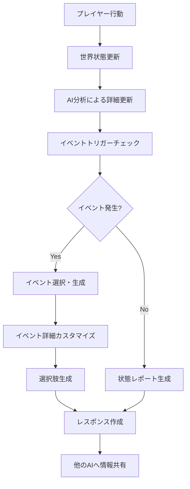

# 世界の意識AI (The World) 仕様書

**最終更新日:** 2025/06/16  
**ドキュメントバージョン:** 1.0

## 概要

世界の意識AI（The World）は、階層世界『ゲスタロカ』全体をマクロな視点から管理するAIエージェントです。プレイヤーコミュニティの行動の総和が世界に与える影響を観測し、世界規模のイベントを発生させることで、動的で生きた世界を演出します。

## 基本設計

### 役割と責務

1. **世界状態の監視と管理**
   - 平和度、資源状況、魔法活動度、汚染度の追跡
   - 勢力間の関係性と緊張状態の管理
   - プレイヤー行動傾向の分析

2. **マクロイベントの管理**
   - 世界規模イベントの発生判定
   - イベントの詳細生成とカスタマイズ
   - イベントのライフサイクル管理

3. **環境システムの制御**
   - 天候システム
   - 自然災害の発生
   - 超常現象の管理

4. **他のAIとの協調**
   - 脚本家AIへの環境情報提供
   - 状態管理AIとの連携による影響適用
   - 歴史家AIへのイベント記録提供

## 実装詳細

### 世界状態（WorldState）

```python
class WorldState(BaseModel):
    peace_level: float          # 平和度 (0.0-1.0)
    resource_abundance: float   # 資源の豊富さ (0.0-1.0)
    magical_activity: float     # 魔法活動度 (0.0-1.0)
    corruption_level: float     # 汚染度 (0.0-1.0)
    faction_tensions: dict[str, float]  # 勢力間緊張度
    active_events: list[str]    # アクティブイベントID
    event_history: list[dict]   # イベント履歴
```

#### パラメータの意味

- **平和度**: 世界全体の安定性。戦闘が多いと下がり、平和的な活動で上昇
- **資源の豊富さ**: 食料、鉱物、魔法素材などの全体的な供給状況
- **魔法活動度**: 魔法エネルギーの活性度。高いと魔法が強力になるが不安定にも
- **汚染度**: フェイディングや邪悪な力による世界の汚染レベル

### イベントシステム

#### イベント構造（WorldEvent）

```python
class WorldEvent(BaseModel):
    id: str                    # イベントID
    type: str                  # イベントタイプ
    name: str                  # イベント名
    description: str           # イベントの説明
    severity: int              # 影響度 (1-10)
    duration_hours: int        # 持続時間（時間）
    affected_locations: list[str]  # 影響を受ける場所
    prerequisites: dict        # 発生条件
    effects: dict              # 効果
    triggers: list[str]        # トリガー条件
```

#### 実装済みイベントテンプレート

1. **血月の夜（blood_moon）**
   - タイプ: celestial
   - 影響度: 6
   - 前提条件: 汚染度 ≥ 0.6
   - 効果: モンスター出現率2倍、魔法力1.5倍、正気度消耗1.2倍

2. **収穫祭（harvest_festival）**
   - タイプ: cultural
   - 影響度: 3
   - 前提条件: 資源豊富度 ≥ 0.7、平和度 ≥ 0.6
   - 効果: 幸福度1.5倍、交易ボーナス1.3倍、食料生産1.2倍

3. **勢力間戦争（faction_war）**
   - タイプ: political
   - 影響度: 9
   - 前提条件: 勢力間緊張度 ≥ 0.8
   - 効果: 平和度-0.3、交易ペナルティ0.5倍、難民危機発生

4. **魔力の奔流（magical_surge）**
   - タイプ: magical
   - 影響度: 7
   - 前提条件: 魔法活動度 ≥ 0.8
   - 効果: 呪文威力2倍、呪文失敗率1.5倍、ランダムテレポート発生

5. **疫病の流行（plague_outbreak）**
   - タイプ: disaster
   - 影響度: 8
   - 前提条件: 汚染度 ≥ 0.7、資源豊富度 ≤ 0.3
   - 効果: 人口減少0.8倍、交易制限、医療需要3倍

### 処理フロー



### AIレスポンス形式

#### イベント発生時

```json
{
    "agent_role": "the_world",
    "narrative": "不吉な赤い月が空に昇り、モンスターの活動が活発化する...",
    "choices": [
        {"id": "world_event_1", "text": "聖域を探して身を守る"},
        {"id": "world_event_2", "text": "この機会に魔法の力を高める"},
        {"id": "world_event_3", "text": "街の人々を守るために警備に協力する"}
    ],
    "state_changes": {
        "world_event": {
            "id": "blood_moon",
            "type": "celestial",
            "severity": 6,
            ...
        },
        "world_state": {
            "peace_level": 0.7,
            "corruption_level": 0.65,
            ...
        }
    },
    "metadata": {
        "event_id": "blood_moon",
        "event_type": "celestial",
        "severity": 6,
        "duration_hours": 12
    }
}
```

#### 状態レポート時

```json
{
    "agent_role": "the_world",
    "narrative": "朝の光が王都を優しく照らしている。市場には商人たちの活気ある声が響き...",
    "state_changes": {
        "world_state": {
            "peace_level": 0.75,
            "resource_abundance": 0.65,
            ...
        }
    },
    "metadata": {
        "is_status_update": true,
        "active_events": []
    }
}
```

## 他のAIとの連携

### 脚本家AI（Dramatist）との連携
- 世界の現在の雰囲気を物語に反映
- アクティブなイベントの影響を描写に含める
- 環境要因（天候、時間帯）の提供

### 状態管理AI（State Manager）との連携
- イベントによるパラメータ修正値の提供
- 環境修正（天候、場所、時間）の計算基準
- イベント固有のルール適用

### 歴史家AI（Historian）との連携
- 発生したイベントの記録
- 世界史年表への統合用データ
- イベントの因果関係分析支援

### NPC管理AI（NPC Manager）との連携
- イベント時の特殊NPCの生成要請
- NPCの行動パターンへの影響通知
- 難民、商人、兵士などの臨時NPC生成

## 設定可能パラメータ

### 世界状態の変化率
- 平和度変化: ±0.01/アクション（デフォルト）
- AI分析による変化: ±0.1/更新（最大）

### イベント発生確率
- 重要度による重み付け選択
- 前提条件充足時のみ発生可能
- 同時アクティブイベント数制限なし（デフォルト）

### イベント持続時間
- 最短: 12時間（血月など）
- 最長: 336時間/14日（疫病など）
- 期限切れ後の自動クリーンアップ

## パフォーマンス考慮事項

1. **世界状態更新頻度**
   - プレイヤーアクションごとに軽量更新
   - AI分析は必要時のみ実行

2. **イベント管理**
   - アクティブイベントのメモリ内保持
   - 履歴は定期的にDBへ永続化

3. **AI生成コスト**
   - カスタマイズは発生時のみ
   - 選択肢生成は必要最小限

## 今後の拡張予定

1. **季節システム**
   - 四季の循環
   - 季節固有イベント

2. **グローバルクエスト**
   - コミュニティ全体での協力イベント
   - 世界の運命を左右する大規模クエスト

3. **プレイヤー影響力システム**
   - 個人の行動が世界に与える影響度
   - 英雄的行動による世界状態への直接影響

4. **動的イベント生成**
   - AIによる新規イベントの創造
   - プレイヤー行動履歴からの学習