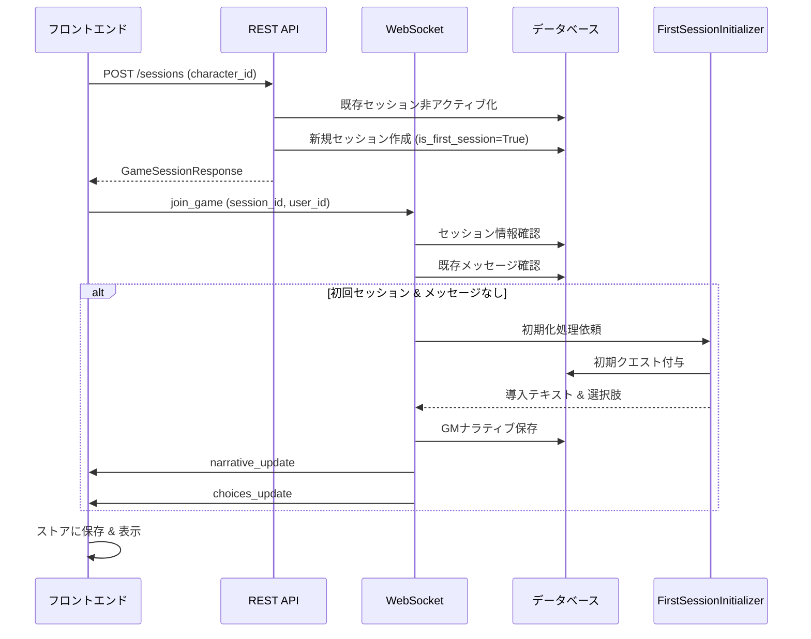
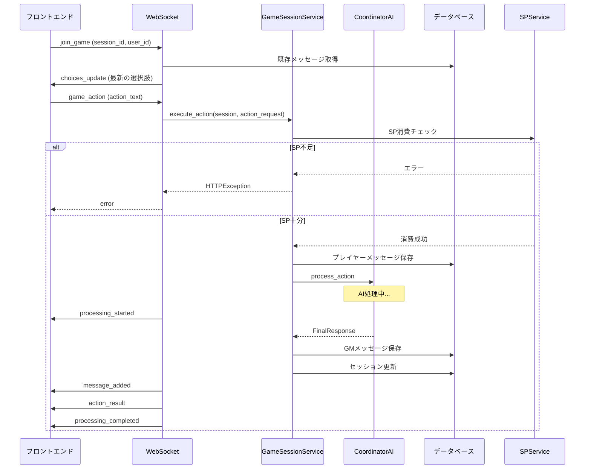
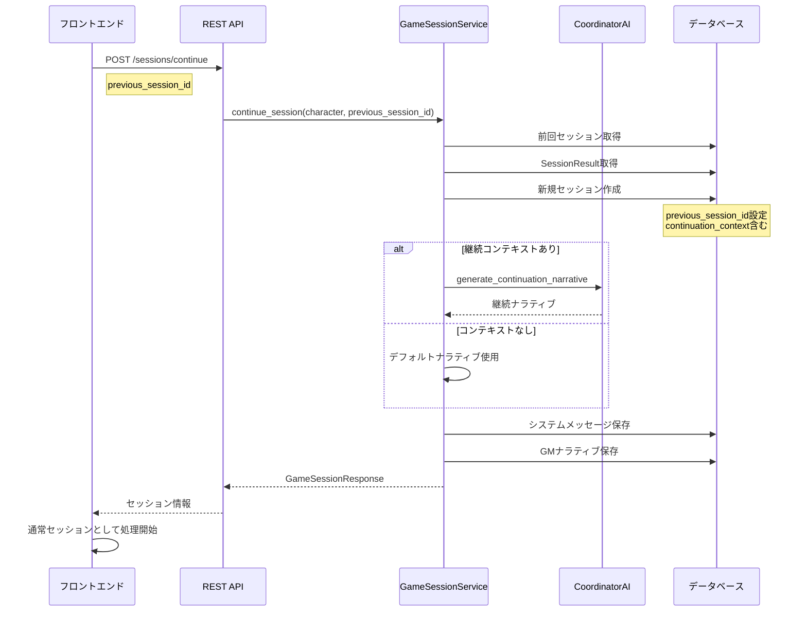
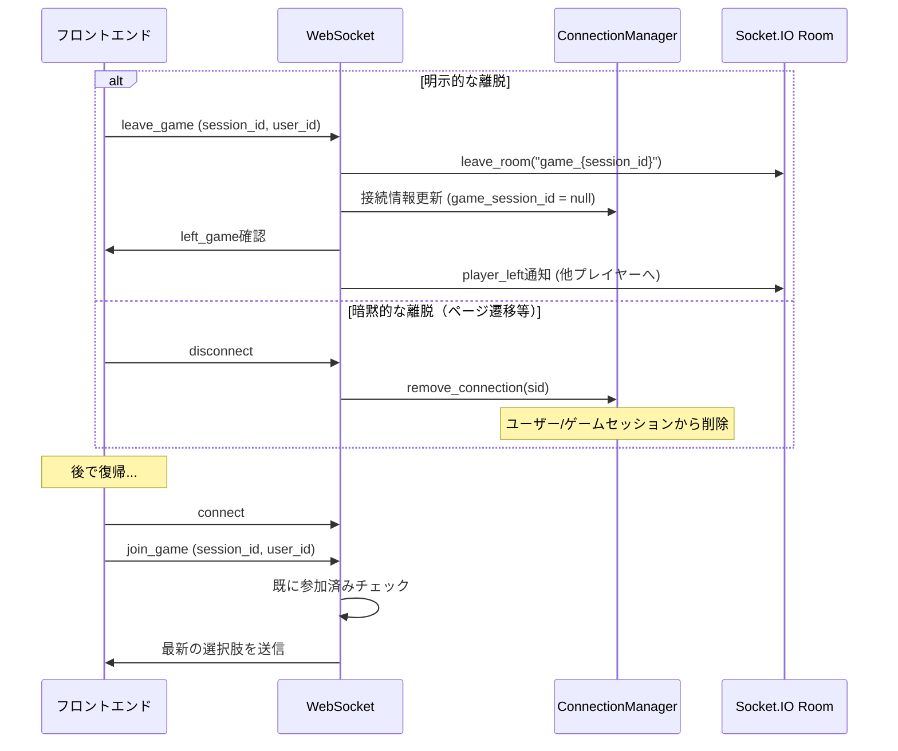
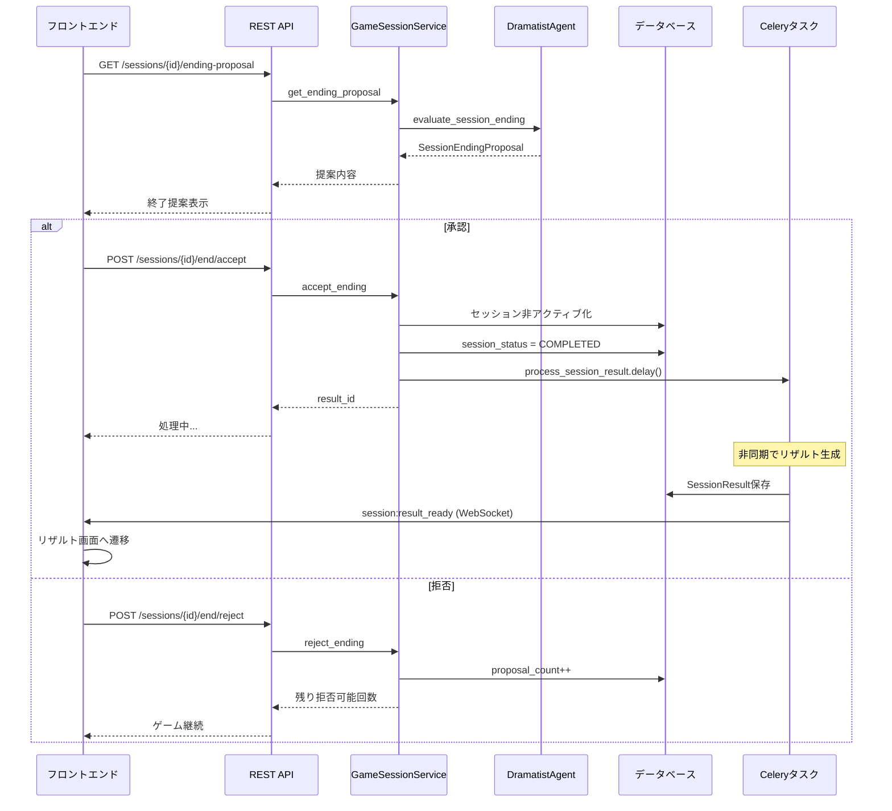

# ゲームセッション処理フロー分析

作成日: 2025-07-11

## 概要

このドキュメントは、ゲスタロカのゲームセッション実装における各ケースの詳細な処理フローを分析したものです。初回セッション、通常セッション、復帰セッション、セッション離脱時、セッション終了時の5つのケースについて、実装の詳細とフロー図を記載しています。

## 1. 初回セッション

初回セッションは、キャラクターが初めてゲームを開始する際の特別な処理フローです。

### 処理の流れ

1. **セッション作成（バックエンド）**
   - REST API: `POST /api/v1/game/sessions`
   - `GameSessionService.create_session()` が呼ばれる
   - 既存のアクティブセッションを非アクティブ化
   - `is_first_session=True` のセッションを作成
   - システムメッセージは保存しない（後でWebSocketで処理）

2. **WebSocket接続とゲーム参加**
   - フロントエンドが `join_game` イベントを送信
   - `websocket/server.py` の `join_game` ハンドラーが処理
   - 初回セッションかつメッセージがない場合：
     - `FirstSessionInitializer` が初期クエストを付与
     - 導入テキストと初期選択肢を生成
     - GMナラティブメッセージとして保存

3. **フロントエンド処理**
   - `useGameWebSocket` フックがイベントを受信
   - `narrative_update` と `choices_update` イベントを処理
   - ゲームセッションストアに保存

### Mermaidフロー図

## 2. 通常セッション

通常セッションは、既存のセッションでゲームプレイを継続する標準的なフローです。

### 処理の流れ

1. **セッション作成/再開**
   - 既存セッションがある場合でも新規作成される
   - `is_first_session=False` で作成
   - システムメッセージ「セッション #N を開始しました」を保存

2. **WebSocket接続とゲーム参加**
   - `join_game` イベントで既存メッセージを確認
   - 最新の選択肢のみを送信（ナラティブは送信しない）
   - フロントエンドのストアから履歴を読み込み

3. **アクション実行**
   - `game_action` イベントでアクション送信
   - `GameSessionService.execute_action()` で処理
   - SP消費、AI処理、メッセージ保存
   - WebSocketで結果を返信

### Mermaidフロー図

## 3. 復帰セッション

前回のセッション結果を引き継いで新しいセッションを開始するフローです。

### 処理の流れ

1. **継続セッション作成**
   - REST API: `POST /api/v1/game/sessions/continue`
   - `GameSessionService.continue_session()` が呼ばれる
   - 前回のセッション結果（SessionResult）を取得
   - 継続コンテキストを含む新規セッション作成

2. **継続ナラティブの生成**
   - AIが前回の結果を踏まえた継続ナラティブを生成
   - GMナラティブメッセージとして保存
   - ストーリーアークの引き継ぎ

3. **通常セッションと同様の処理**
   - WebSocket接続後は通常セッションと同じ

### Mermaidフロー図

## 4. セッション離脱時

プレイヤーがセッションから一時的に離脱する際の処理です。

### 処理の流れ

1. **明示的な離脱**
   - `leave_game` イベントを送信
   - Socket.IOのroomから退出
   - 接続情報は更新（game_session_idをnullに）
   - 他のプレイヤーに通知

2. **暗黙的な離脱**
   - ページ遷移やリロード時
   - WebSocket接続は自動的に切断
   - `disconnect` イベントで接続情報削除

3. **復帰時の処理**
   - 再度 `join_game` を実行
   - 既存のメッセージと選択肢を読み込み

### Mermaidフロー図

## 5. セッション終了時

セッションを正式に終了する際の処理フローです。

### 処理の流れ

1. **終了提案システム**
   - `get_ending_proposal` で終了提案を取得
   - AIが現在の状況から終了の適切性を判断
   - 最大3回まで拒否可能

2. **終了承認時**
   - `accept_ending` を呼び出し
   - セッションを非アクティブ化
   - Celeryタスクでリザルト処理を開始

3. **リザルト生成**
   - `SessionResult` を非同期で生成
   - ストーリーサマリー、獲得経験値、未解決プロット等
   - 完了後に `session:result_ready` イベント

### Mermaidフロー図

## 既知の問題と注意点

### 1. メッセージ重複問題
- WebSocketイベントの重複送信
- フロントエンドでの重複チェック実装
- ID重複チェックでの対処

### 2. 初回セッション初期化タイミング
- `join_game` 時に初期化（REST APIではなく）
- 既存メッセージチェックで重複防止

### 3. SP消費エラー処理
- SP不足時の適切なエラーハンドリング
- WebSocketエラーイベントでの通知

### 4. セッション状態の永続化
- フロントエンドストアでの永続化（localStorage）
- リロード時の状態復元

### 5. 並行処理の考慮
- 同一セッションへの複数接続対応
- メッセージ順序の保証

## 推奨される改善点

1. **トランザクション管理の強化**
   - メッセージ保存とセッション更新の原子性
   - エラー時のロールバック処理

2. **イベント順序の保証**
   - WebSocketイベントの順序制御
   - クライアント側でのバッファリング

3. **エラーリカバリー**
   - 接続断時の自動再接続
   - 未送信アクションの再送信

4. **パフォーマンス最適化**
   - メッセージの差分送信
   - 大量メッセージ時のページネーション

5. **セッション管理の改善**
   - セッションタイムアウト処理
   - 長時間アイドル時の自動保存