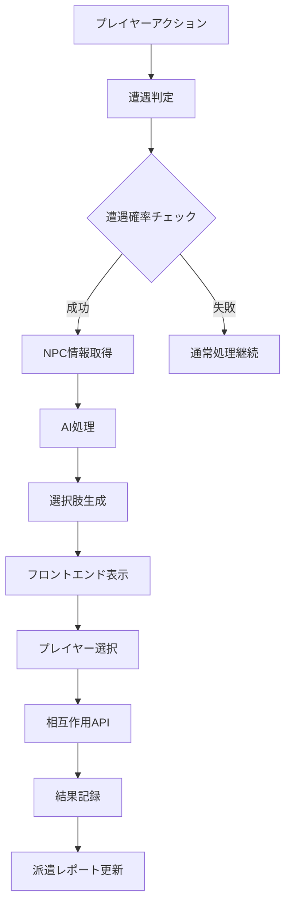

# ログ遭遇システム実装詳細

## 最終更新: 2025-07-02

## 概要

ログ遭遇システムは、他のプレイヤーから派遣されたログNPCとの出会いを管理し、プレイヤー間の間接的な相互作用を実現するシステムです。

## システム構成

### 1. 遭遇確率システム

#### 実装ファイル
- `backend/app/services/game_session.py`
- メソッド: `GameSessionService._calculate_encounter_chance()`

#### 確率計算ロジック
```python
# 基本遭遇確率: 30%
base_chance = 0.3

# 目的タイプによる修正
objective_modifiers = {
    DispatchObjectiveType.SOCIAL_INTERACTION: 0.5,  # +50%
    DispatchObjectiveType.TRADE_COMMERCE: 0.3,      # +30%
    DispatchObjectiveType.EXPLORATION: 0.2,          # +20%
    DispatchObjectiveType.GUARD_PATROL: 0.1,         # +10%
}

# 性格特性による修正
personality_modifiers = {
    "社交的": 0.1,    # +10%
    "友好的": 0.1,    # +10%
    "人見知り": -0.1,  # -10%
    "慎重": -0.1,     # -10%
    "好奇心旺盛": 0.05 # +5%
}

# 汚染度による修正
contamination_modifier = contamination_level * 0.1
```

### 2. 複数NPC同時遭遇

#### 仕様
- 最大3体までの同時遭遇が可能
- 各NPCに対する個別の選択肢を生成
- 全NPCへの一括アクションをサポート

#### 実装ファイル
- `backend/app/services/ai/agents/npc_manager.py`
- メソッド: `NPCManagerAgent._handle_log_npc_encounters()`

### 3. アイテム交換システム

#### APIエンドポイント
```python
POST /api/v1/dispatches/encounters/{encounter_id}/interact
```

#### リクエスト形式
```json
{
  "interaction_type": "trade",
  "offered_items": ["item_id_1", "item_id_2"],
  "requested_items": ["item_id_3"],
  "metadata": {
    "message": "素晴らしいアイテムですね"
  }
}
```

#### 相互作用タイプ
- `talk`: 会話のみ
- `trade`: アイテム交換
- `help`: 援助・協力

### 4. 遭遇記録の永続化

#### DispatchEncounterモデル
```python
class DispatchEncounter(SQLModel, table=True):
    id: UUID
    dispatch_id: UUID  # 派遣ID
    encountered_by_character_id: UUID  # 遭遇したキャラクター
    location_id: UUID  # 遭遇場所
    encounter_type: str  # 遭遇タイプ
    interaction_result: dict  # 相互作用結果
    items_exchanged: list[dict]  # 交換アイテム
    relationship_change: float  # 関係性変化
    narrative: str  # 生成された物語
    created_at: datetime
```

## フロントエンド実装

### 1. NPCEncounterManager
**ファイル**: `frontend/src/features/game/components/NPCEncounterManager.tsx`

#### 機能
- 単一NPCの場合は既存のNPCEncounterDialogを使用
- 複数NPCの場合はタブ形式で切り替え表示
- 全NPCへの一括アクション
- 最大3体までの同時表示

### 2. ItemExchangeDialog
**ファイル**: `frontend/src/features/game/components/ItemExchangeDialog.tsx`

#### 機能
- プレイヤーとNPCのアイテムリストを左右に表示
- チェックボックスによるアイテム選択
- アイテムのレアリティ表示（色分け）
- 価値バランスの自動計算（20%の差まで許容）
- 交換プレビュー機能

### 3. WebSocketフック更新
**ファイル**: `frontend/src/hooks/useWebSocket.ts`

#### 変更点
- `currentNPCEncounter`を`currentNPCEncounters`配列に変更
- 複数NPC遭遇時の通知メッセージ対応
- 個別NPC離脱時の配列管理

## 遭遇フロー

### 1. 遭遇判定
1. プレイヤーがアクションを実行
2. `check_npc_encounters()`で候補NPCを取得
3. 各NPCに対して確率計算を実行
4. 確率に基づいて実際の遭遇を決定

### 2. AI処理
1. 複数NPCの情報を一括でAIに送信
2. 個別および全体のナラティブ生成
3. NPCごとの選択肢生成

### 3. プレイヤー相互作用
1. フロントエンドで選択肢を表示
2. プレイヤーが行動を選択
3. APIエンドポイントで相互作用を処理
4. 結果をDispatchEncounterに記録

### 4. 派遣元への報告
1. 遭遇データを蓄積
2. 派遣終了時に総合レポート生成
3. 派遣元プレイヤーへ通知

## データフロー



## 性能考慮事項

### 遭遇判定の最適化
- 候補NPCのクエリに適切なインデックス使用
- 場所による事前フィルタリング
- 確率計算のキャッシング

### WebSocket通信
- 複数NPC情報の効率的な送信
- 差分更新による通信量削減
- 接続状態の監視と自動再接続

## セキュリティ考慮事項

### API保護
- 遭遇IDの検証
- プレイヤー権限チェック
- レート制限

### データ検証
- アイテムIDの存在確認
- 価値バランスのサーバー側検証
- 不正な相互作用の防止

## 今後の拡張予定

### 短期
1. 記憶継承システムの実装
2. 遭遇履歴の詳細表示
3. 関係性メーターの可視化

### 中期
1. クエスト付与メカニクス
2. 共同探索の開始
3. 情報交換システム

### 長期
1. NPCの成長・進化
2. 派遣ログ間の独自ストーリー生成
3. プレイヤー評価システム

## 関連ドキュメント

- [ログ派遣システム](./03_worldbuilding/game_mechanics/logDispatchSystem.md)
- [NPCインタラクション設計](./02_architecture/ai/npc_interactions.md)
- [WebSocket通信仕様](./05_implementation/02_frontend/websocket.md)