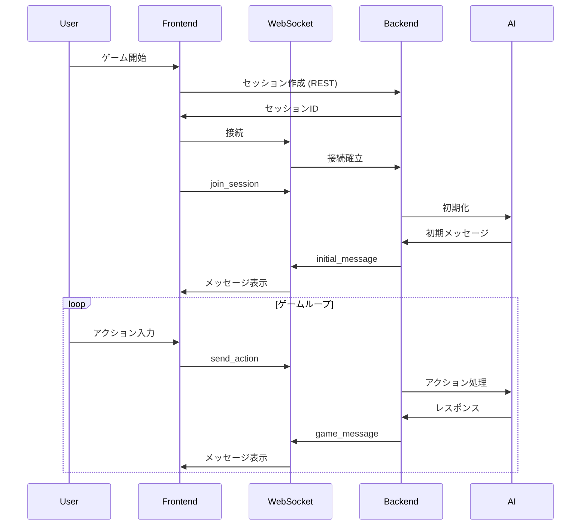

# 新ゲームセッション実装設計書

作成日: 2025-07-11

## 概要

既存のゲームセッション実装を破棄し、シンプルで信頼性の高い新実装を行う。

## 設計原則

### 1. シンプリシティ・ファースト
- 必要最小限の機能から開始
- 複雑な状態管理を避ける
- 明確なデータフロー

### 2. WebSocketファースト
- ゲーム内通信は全てWebSocket経由
- REST APIは認証とメタデータのみ
- リアルタイム性を重視

### 3. 段階的実装
- MVPから開始し、機能を段階的に追加
- 各段階で完全に動作することを確認
- テスト駆動開発

## アーキテクチャ

### 全体構成

```
フロントエンド                    バックエンド
    │                              │
    ├─ REST API ─────────────────→├─ 認証
    │  (認証・メタデータ)           │  セッション作成
    │                              │  セッション一覧
    │                              │
    └─ WebSocket ─────────────────→└─ ゲームプレイ
       (ゲームプレイ全般)              メッセージ送受信
                                      状態管理
```

### データフロー



## 実装フェーズ

### フェーズ1: MVP（最小限の実装）

#### 機能
1. セッション作成（REST API）
2. WebSocket接続
3. セッション参加
4. メッセージ送受信
5. セッション終了

#### バックエンド実装
```python
# /backend/app/api/api_v1/endpoints/game_v2.py
@router.post("/sessions")
async def create_session(character_id: str, user: User):
    """セッション作成（最小限）"""
    pass

@router.get("/sessions/{session_id}")
async def get_session(session_id: str, user: User):
    """セッション情報取得"""
    pass

# /backend/app/websocket/game_v2.py
@sio.event
async def connect(sid, environ, auth):
    """WebSocket接続"""
    pass

@sio.event
async def join_session(sid, data):
    """セッション参加"""
    pass

@sio.event
async def send_action(sid, data):
    """アクション送信"""
    pass

@sio.event
async def leave_session(sid, data):
    """セッション離脱"""
    pass
```

#### フロントエンド実装
```typescript
// /frontend/src/features/game-v2/hooks/useGameSession.ts
export function useGameSession(sessionId: string) {
  // 最小限のWebSocket管理
  // メッセージの送受信
  // 接続状態の管理
}

// /frontend/src/features/game-v2/components/GameSession.tsx
export function GameSession({ sessionId }: Props) {
  // シンプルなUI
  // メッセージ表示
  // アクション入力
}
```

### フェーズ2: 基本機能追加

1. 選択肢システム
2. キャラクター状態表示
3. シーン管理
4. エラーハンドリング

### フェーズ3: 高度な機能

1. NPC遭遇システム
2. 戦闘システム
3. セッション終了提案
4. リザルト処理

## テスト戦略

### 単体テスト
- 各関数・コンポーネントの個別テスト
- モックを活用した独立性の確保

### 統合テスト
- WebSocket通信のE2Eテスト
- 実際のゲームフローのテスト

### 手動テスト
- 各フェーズ完了時に実際にプレイ
- ユーザビリティの確認

## 移行計画

### データ互換性
- 既存のデータベース構造は維持
- 新実装で既存データを読み込み可能に

### 段階的移行
1. 新実装を別エンドポイントで公開
2. 内部テスト実施
3. 段階的にユーザーを移行
4. 旧実装を廃止

## リスクと対策

### リスク
1. 既存機能の欠落
2. パフォーマンス低下
3. 新たなバグの発生

### 対策
1. 機能リストの作成と確認
2. パフォーマンステストの実施
3. 十分なテスト期間の確保

## スケジュール

- **今日**: アーカイブ完了、設計書作成
- **次回作業時**: フェーズ1実装開始
- **1週間後**: フェーズ1完了目標
- **2週間後**: フェーズ2完了目標
- **3週間後**: フェーズ3完了目標

## 成功指標

1. WebSocket接続が確実に確立される
2. メッセージの送受信が遅延なく行われる
3. エラー発生時の適切なリカバリー
4. ユーザー体験の向上

## 参考資料

- Socket.IO公式ドキュメント
- FastAPI WebSocketドキュメント
- 既存実装の分析結果