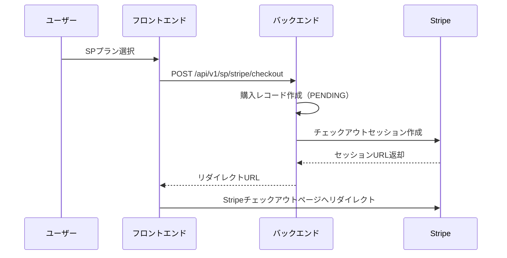
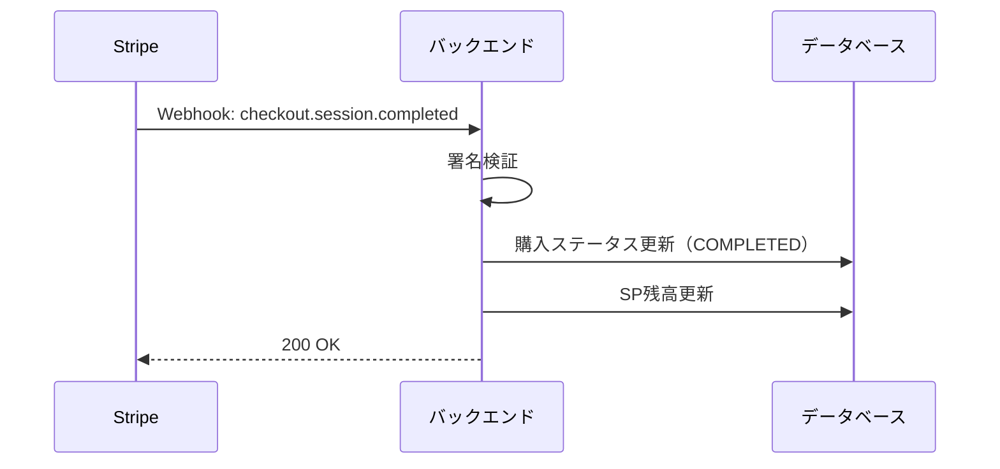

# Stripe統合ガイド

## 概要

このドキュメントでは、ゲスタロカにおけるStripe決済システムの統合について説明します。

## 現在の実装状況

### テストモード（現在のデフォルト）

- **動作環境**: 開発・テスト環境
- **決済処理**: 実際の決済は行われない
- **SP付与**: test_reason入力後、自動または手動承認

### 本番モード（Stripe統合）

- **動作環境**: 本番環境
- **決済処理**: Stripeを通じて実際の決済
- **SP付与**: 決済完了後、Webhookで自動付与

## 環境変数設定

### 必須設定

```env
# 支払いモード設定
PAYMENT_MODE=production

# Stripe API設定
STRIPE_API_KEY=sk_live_xxxxx  # 本番用APIキー
STRIPE_WEBHOOK_SECRET=whsec_xxxxx  # Webhook署名シークレット

# Stripe価格ID（事前にStripeダッシュボードで作成）
STRIPE_PRICE_ID_SMALL=price_xxxxx
STRIPE_PRICE_ID_MEDIUM=price_xxxxx
STRIPE_PRICE_ID_LARGE=price_xxxxx
STRIPE_PRICE_ID_XLARGE=price_xxxxx

# リダイレクトURL
STRIPE_SUCCESS_URL=https://yourdomain.com/sp/success
STRIPE_CANCEL_URL=https://yourdomain.com/sp/cancel
```

## Stripeダッシュボードでの設定

### 1. 商品の作成

1. Stripeダッシュボードにログイン
2. 「商品」→「新規作成」
3. 以下の商品を作成：
   - Small Pack (500 SP) - ¥500
   - Medium Pack (1,200 SP) - ¥1,000
   - Large Pack (3,000 SP) - ¥2,000
   - XLarge Pack (8,000 SP) - ¥4,000

### 2. Webhookエンドポイントの設定

1. 「開発者」→「Webhook」
2. 「エンドポイントを追加」
3. エンドポイントURL: `https://yourdomain.com/api/v1/stripe/webhook`
4. リッスンするイベント：
   - `checkout.session.completed`
   - `payment_intent.succeeded`
   - `payment_intent.payment_failed`

### 3. Webhook署名シークレットの取得

エンドポイント作成後、署名シークレットをコピーして環境変数に設定

## セキュリティ考慮事項

### 1. APIキーの管理

- **絶対にコミットしない**: `.env`ファイルは`.gitignore`に含める
- **環境変数で管理**: 本番環境では環境変数として設定
- **最小権限の原則**: 必要最小限の権限のみ付与

### 2. Webhook検証

- **署名検証**: 全てのWebhookリクエストで署名を検証
- **イベントID重複チェック**: 同一イベントの重複処理を防ぐ
- **タイムアウト設定**: 長時間実行を防ぐ

### 3. HTTPS必須

- **本番環境**: 必ずHTTPS経由でアクセス
- **リダイレクト**: HTTPアクセスはHTTPSにリダイレクト

### 4. エラーハンドリング

- **適切なエラーメッセージ**: 内部情報を露出しない
- **ロギング**: 全ての決済関連操作をログに記録
- **監視**: 異常な決済パターンを検知

## 決済フロー

### 1. チェックアウト開始



### 2. 決済完了



## トラブルシューティング

### Webhookが受信されない

1. エンドポイントURLが正しいか確認
2. ファイアウォール設定を確認
3. Stripeダッシュボードでイベントログを確認

### 署名検証エラー

1. Webhook署名シークレットが正しいか確認
2. リクエストボディが変更されていないか確認
3. タイムスタンプが5分以内か確認

### 決済後SPが付与されない

1. Webhookイベントのステータスを確認
2. バックエンドのエラーログを確認
3. 購入レコードのステータスを確認

## 本番移行チェックリスト

- [ ] Stripe本番APIキーの設定
- [ ] Webhook本番エンドポイントの設定
- [ ] HTTPS証明書の設定
- [ ] 環境変数の本番値設定
- [ ] エラー監視の設定
- [ ] バックアップ体制の確立
- [ ] 決済フローのE2Eテスト
- [ ] ロールバック手順の準備