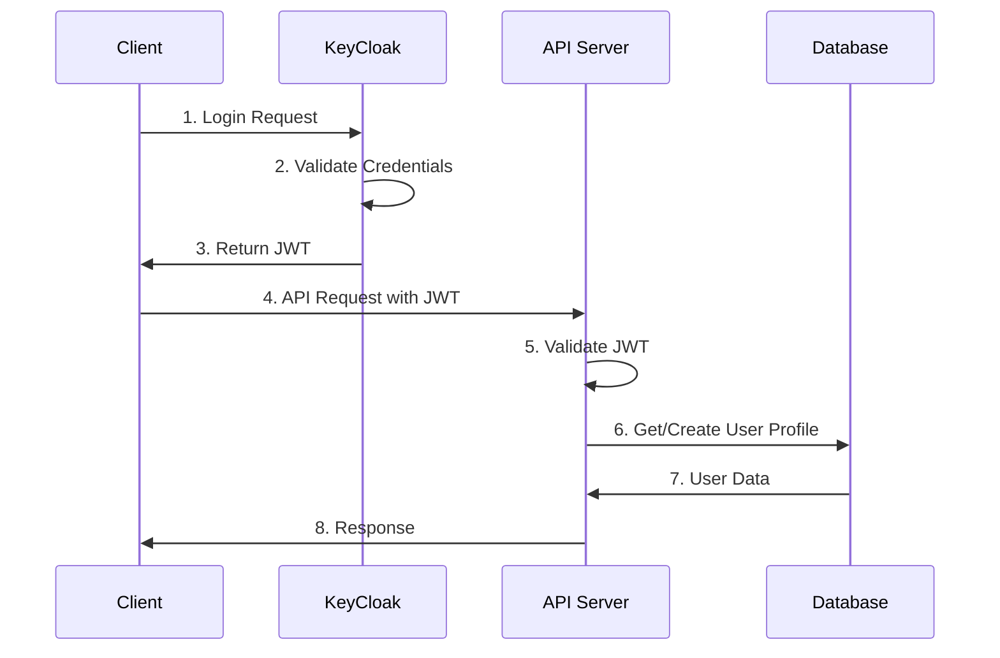
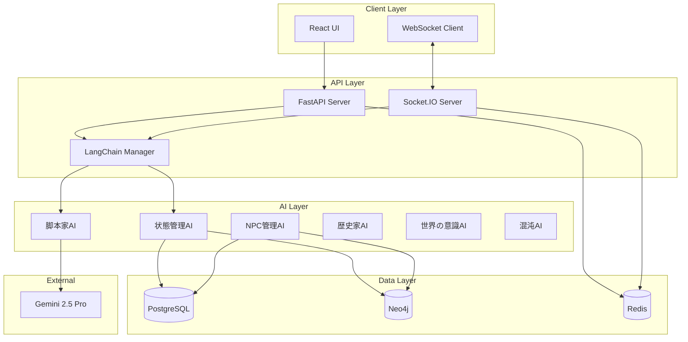
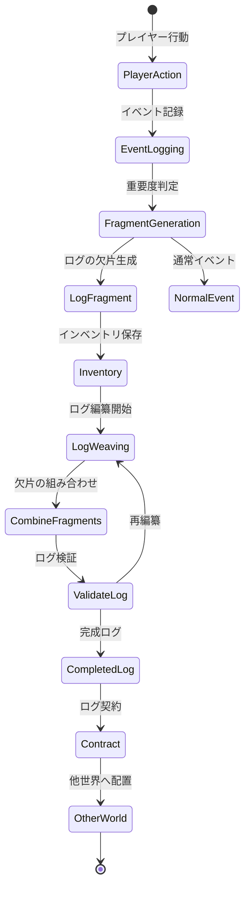
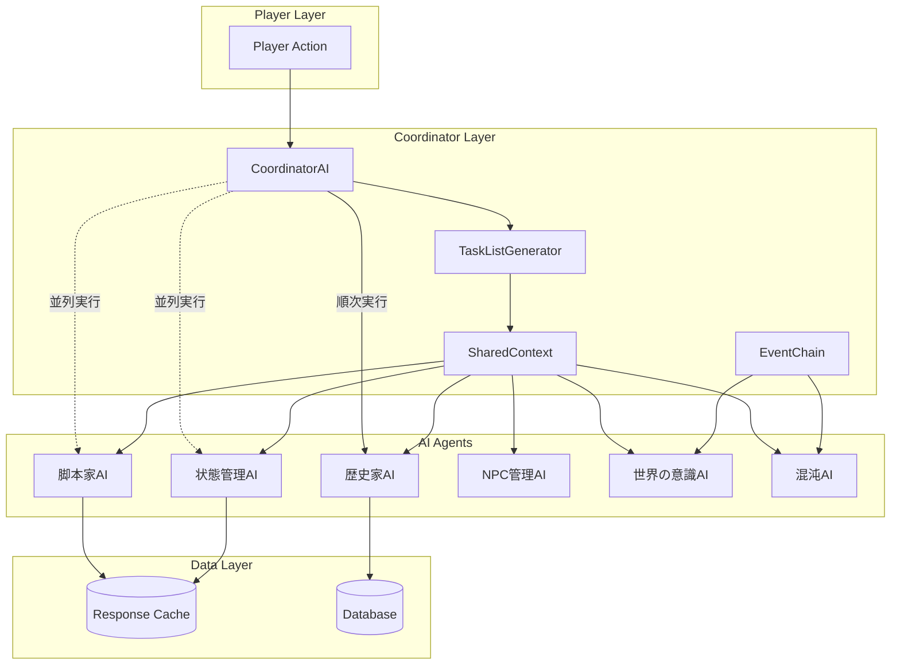
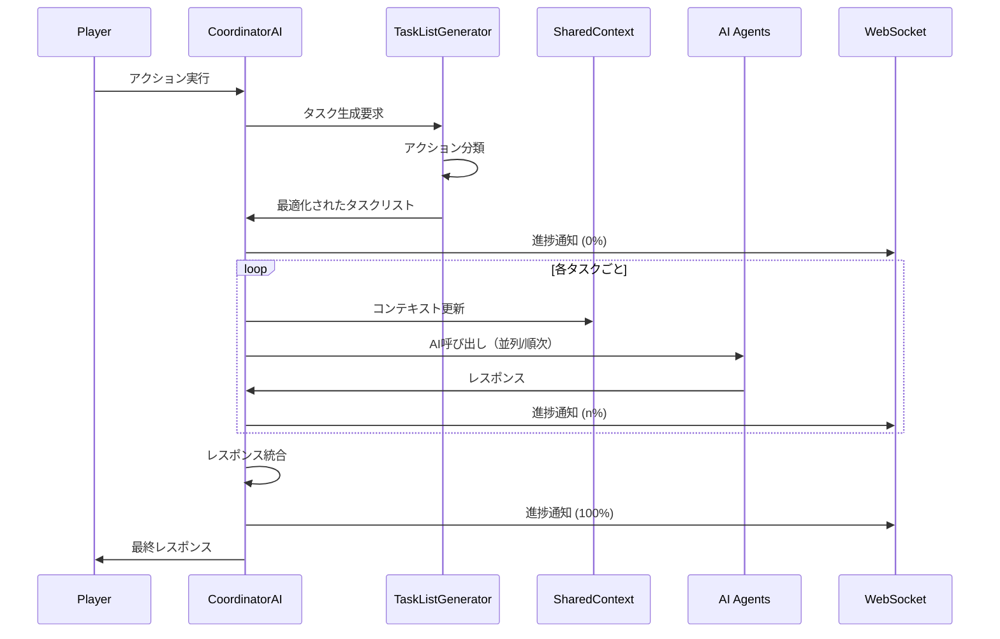
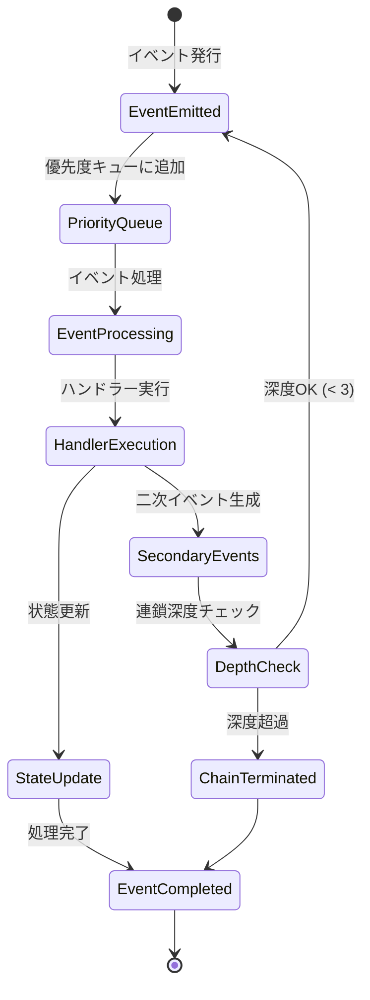
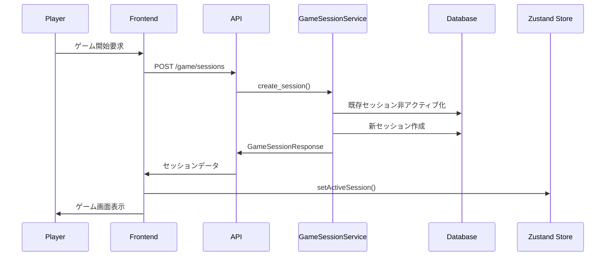
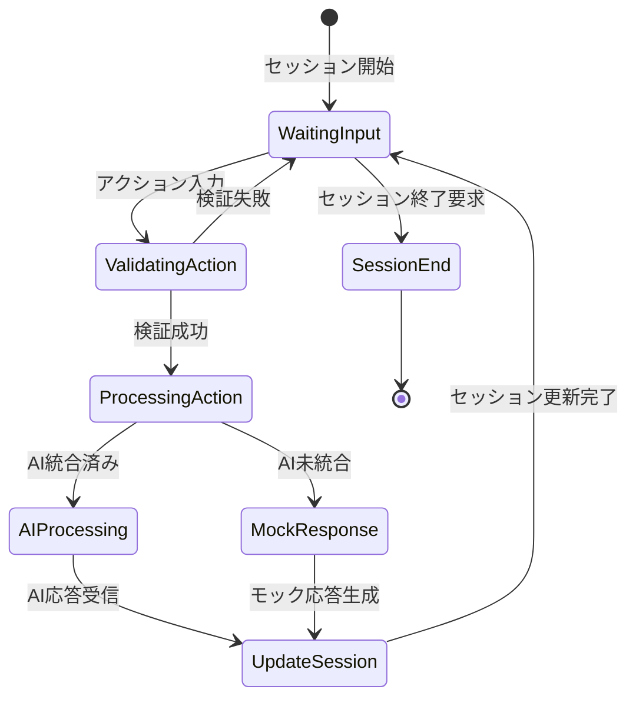

# システムパターン - ログバース (Logverse)

**最終更新日:** 2025/06/14  
**ドキュメントバージョン:** 1.0

## 概要

本ドキュメントは、ログバースのアーキテクチャパターン、データフロー、および設計原則を定義します。すべての実装はこれらのパターンに従う必要があります。

## アーキテクチャ原則

### 1. 関心の分離 (Separation of Concerns)
- **認証**: KeyCloakに完全委譲
- **ビジネスロジック**: FastAPIアプリケーション
- **リアルタイム通信**: WebSocket専用レイヤー
- **非同期処理**: Celeryワーカー
- **データ永続化**: PostgreSQL（構造化）+ Neo4j（関係性）

### 2. イベント駆動アーキテクチャ
- すべてのプレイヤー行動はイベントとして記録
- イベントソーシングによる状態再構築
- 非同期イベントハンドラーによる拡張性

### 3. AI協調パターン
- 各AIエージェントは単一責任原則に従う
- AIエージェント間の通信はデータベース経由
- 明確なインターフェースによる疎結合

## データフロー図

### 1. 認証フロー



### 2. ゲームプレイフロー



### 3. ログ生成フロー



## データモデルパターン

### 1. エンティティ分離

```
PostgreSQL (構造化データ)
├── users (KeyCloak IDと紐付け)
├── characters (Player, LogNPC, NPC)
├── skills
├── items
├── events (イベントログ)
└── log_fragments

Neo4j (関係性データ)
├── Player nodes
├── LogNPC nodes
├── NPC nodes
├── Location nodes
└── Relationships (INTERACTED_WITH, LOCATED_IN, etc.)
```

### 2. イベントソーシング

```python
# イベント構造
class GameEvent:
    event_id: str
    timestamp: datetime
    player_id: str
    event_type: str
    payload: dict
    resulting_state_changes: dict
```

### 3. ログフラグメント構造

```python
# ログの欠片
class LogFragment:
    fragment_id: str
    player_id: str
    timestamp: datetime
    keywords: List[str]  # ["勇敢", "探索", etc.]
    emotion_value: float  # -1.0 to 1.0
    rarity: str  # "common", "uncommon", "rare", etc.
    backstory: str  # 物語的な記述
    source_event_ids: List[str]
```

## API設計パターン

### 1. RESTful + WebSocket ハイブリッド

```
RESTful API (HTTP)
├── 認証・認可
├── キャラクター作成・管理
├── 静的データ取得
└── 非リアルタイム操作

WebSocket (Socket.IO)
├── ゲームプレイ中の行動
├── リアルタイム物語生成
├── 戦闘システム
└── プレイヤー間相互作用
```

### 2. フロントエンドルーティングパターン

**TanStack Router実装:**
```typescript
// ファイルベースルーティング構造
src/routes/
├── __root.tsx         // ルートレイアウト + プロバイダー
├── index.tsx          // ホームページ (/)
├── login.tsx          // ログインページ (/login)
├── dashboard.tsx      // ダッシュボード (/dashboard)
├── character.create.tsx  // キャラクター作成 (/character/create)
├── game.$sessionId.tsx   // ゲームページ (/game/$sessionId)
├── logs.tsx           // ログ管理 (/logs)
└── settings.tsx       // 設定 (/settings)

// 型安全なナビゲーション
const navigate = useNavigate()
navigate({ to: '/dashboard' })  // コンパイル時に型チェック

// 認証ガード統合
export const Route = createFileRoute('/dashboard')({
  component: () => (
    <ProtectedRoute>
      <Layout>
        <DashboardPage />
      </Layout>
    </ProtectedRoute>
  ),
})
```

### 3. API レスポンス構造

```python
# 統一レスポンス形式
class APIResponse:
    success: bool
    data: Optional[dict]
    error: Optional[str]
    metadata: dict  # ページネーション、処理時間等
```

## AI協調パターン

### 1. AI協調動作プロトコル



### 2. タスク最適化フロー



### 3. イベント連鎖システム



### 4. AI責任分離（協調動作版）

| AI | 入力 | 処理 | 出力 | 協調役割 |
|----|------|------|------|----------|
| 脚本家AI | イベント、コンテキスト | 物語生成 | テキスト、選択肢 | 常に必要 |
| 状態管理AI | アクション、ルール | 状態計算 | 更新されたステート | 行動判定時必要 |
| NPC管理AI | 世界の要求 | キャラクター生成 | NPCデータ | NPC関連時のみ |
| 歴史家AI | 全イベント | 歴史編纂 | 構造化された歴史 | 重要イベント時 |
| 世界の意識AI | 集合的行動 | マクロイベント判定 | 世界イベント | 場面転換時 |
| 混沌AI | ランダムシード | 異常イベント生成 | カオスイベント | 確率的に発生 |

### 5. 共有コンテキスト構造

```python
@dataclass
class SharedContext:
    # セッション情報
    session_id: str
    turn_number: int
    
    # 世界状態
    world_state: WorldState
    weather: Weather
    time_of_day: TimeOfDay
    active_events: List[GameEvent]
    
    # キャラクター状態
    player_state: CharacterState
    active_npcs: Dict[str, NPCState]
    
    # 履歴情報
    recent_actions: deque[PlayerAction]  # 最新10件
    recent_events: deque[GameEvent]     # 最新20件
    important_decisions: List[Decision]
    
    # AI決定履歴
    ai_decisions: Dict[str, List[AIDecision]]
    
    # 一時効果
    active_effects: List[TemporaryEffect]
    environmental_modifiers: Dict[str, float]
```

## エラーハンドリングパターン

### 1. 階層的エラー処理

```python
# エラー階層
class GameError(Exception):
    """基底エラークラス"""
    
class ValidationError(GameError):
    """入力検証エラー"""
    
class StateError(GameError):
    """ゲーム状態エラー"""
    
class AIError(GameError):
    """AI処理エラー"""
```

### 2. グレースフルデグラデーション

- LLM応答失敗時: 事前定義済みの応答を使用
- データベース接続失敗時: キャッシュから応答
- AI協調失敗時: 単一AIでの処理継続

## パフォーマンスパターン

### 1. キャッシング戦略

```
Redis キャッシュ層
├── セッションデータ (TTL: 1時間)
├── 頻繁にアクセスされるキャラクターデータ (TTL: 10分)
├── LLM応答キャッシュ (TTL: 5分)
└── 静的ゲームデータ (TTL: 1日)
```

### 2. 非同期処理

```python
# Celeryタスク例
@celery_task
async def process_log_generation(event_id: str):
    """ログ生成の非同期処理"""
    # 重い処理をバックグラウンドで実行
    pass

@celery_task
async def update_world_statistics():
    """世界統計の定期更新"""
    pass
```

## セキュリティパターン

### 1. 入力検証

```python
# Pydanticによる厳密な型検証
class PlayerAction(BaseModel):
    action_type: str
    target: Optional[str]
    parameters: dict
    
    @validator('action_type')
    def validate_action_type(cls, v):
        if v not in ALLOWED_ACTIONS:
            raise ValueError(f"Invalid action type: {v}")
        return v
```

### 2. プロンプトインジェクション対策

```python
# LLMプロンプトのサニタイゼーション
def sanitize_user_input(input_text: str) -> str:
    # 特殊文字のエスケープ
    # プロンプト区切り文字の除去
    # 長さ制限の適用
    return sanitized_text
```

## テスト戦略パターン

### 1. テストピラミッド

```
単体テスト (70%)
├── ビジネスロジック
├── データ変換
└── ユーティリティ関数

統合テスト (20%)
├── API エンドポイント
├── データベース操作
└── AI連携

E2Eテスト (10%)
├── 主要なユーザーフロー
└── クリティカルパス
```

### 2. モックパターン

```python
# AI応答のモック
class MockLLMClient:
    def generate_response(self, prompt: str) -> str:
        return PREDEFINED_RESPONSES.get(
            prompt_type(prompt),
            "デフォルト応答"
        )
```

## デプロイメントパターン

### 1. コンテナ構成

```yaml
services:
  frontend:
    build: ./frontend
    environment:
      - NODE_ENV=production
  
  backend:
    build: ./backend
    environment:
      - ENVIRONMENT=production
    depends_on:
      - postgres
      - neo4j
      - redis
  
  worker:
    build: ./backend
    command: celery worker
    depends_on:
      - redis
```

### 2. 環境別設定

```
開発環境
├── ローカルDB
├── モックLLM
└── デバッグモード有効

ステージング環境
├── 隔離されたDB
├── 実LLM（レート制限付き）
└── 本番同等の構成

本番環境
├── 高可用性DB
├── 実LLM（フルアクセス）
└── 監視・アラート有効
```

## ゲームセッション管理パターン

### 1. セッション状態管理フロー



### 2. アクション実行パターン



### 3. 状態管理統合パターン

```typescript
// React Query + Zustand 統合パターン
export const useGameSessionFlow = (sessionId: string) => {
  // サーバー状態管理（React Query）
  const { data: session } = useGameSession(sessionId)
  
  // クライアント状態管理（Zustand）
  const { activeSession, setActiveSession, getSessionMessages } = useGameSessionStore()
  
  // 統合効果
  useEffect(() => {
    if (session && session.id === sessionId) {
      setActiveSession(session)
    }
  }, [session, sessionId, setActiveSession])
  
  return {
    session,
    messages: getSessionMessages(sessionId),
    isActive: activeSession?.id === sessionId
  }
}
```

### 4. エラーハンドリングパターン

```python
# サービス層エラーハンドリング
class GameSessionService:
    async def create_session(self, user_id: str, data: GameSessionCreate):
        try:
            # キャラクター所有権チェック
            character = await self._validate_character_ownership(user_id, data.character_id)
            
            # 既存セッション処理
            await self._deactivate_existing_sessions(data.character_id)
            
            # 新セッション作成
            session = await self._create_new_session(character, data)
            
            return self._to_response(session, character)
            
        except CharacterNotFoundError:
            raise HTTPException(status_code=404, detail="キャラクターが見つかりません")
        except PermissionError:
            raise HTTPException(status_code=403, detail="このキャラクターにアクセスする権限がありません")
        except Exception as e:
            logger.error("Session creation failed", error=str(e))
            raise HTTPException(status_code=500, detail="セッションの作成に失敗しました")
```

### 5. UI状態管理パターン

```typescript
// メッセージ履歴管理
interface GameSessionState {
  activeSession: GameSession | null
  messageHistory: Record<string, GameMessage[]>  // sessionId -> messages
  currentChoices: string[] | null
  isExecutingAction: boolean
}

// 永続化戦略
const gameSessionStore = persist(
  (set, get) => ({
    // ストア実装
  }),
  {
    name: 'game-session-store',
    partialize: (state) => ({
      activeSession: state.activeSession,
      messageHistory: state.messageHistory, // メッセージ履歴のみ永続化
    }),
  }
)
```

## まとめ

これらのパターンは、ログバースの開発において一貫性と品質を保つための指針です。新機能の実装時は必ずこれらのパターンを参照し、逸脱する場合は明確な理由とドキュメント化が必要です。

**ゲームセッション機能実装により確立されたパターン:**
- サービス層によるビジネスロジック分離
- React Query + Zustand統合による状態管理
- 型安全なAPIクライアント設計（snake_case ↔ camelCase変換）
- 段階的UI実装（基本機能優先のアプローチ）