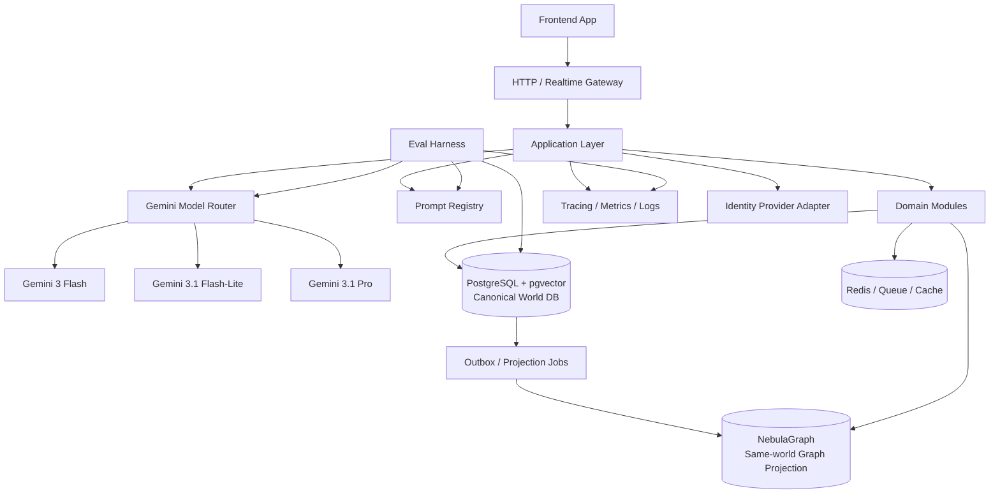

# KingYoSun/gestaloka 現状調査と全面再構築プラン v2

## 1. エグゼクティブサマリ

本プロジェクトの核は、テキストMMOとしての継続世界、6役のGM AI評議会、SP経済圏、そしてプレイヤーとNPCが同一の世界状態に影響し合う永続的な物語体験にある。

v1では「プレイヤーのログが他世界でNPCとして生きる」という表現が中核に置かれていたが、v2ではこの前提を明確に修正する。**プレイヤーもNPCも、同じ世界、同じDBインスタンス、同じ `world_id` 名前空間の中で生きる**。プレイヤーの行動ログは、別世界に転送されてNPC化するのではなく、同一世界内の記憶、噂、伝承、事件、関係性、NPCの行動判断材料として蓄積される。

技術的には、正本DBを **PostgreSQL + pgvector** とし、NebulaGraph は世界内の関係探索・グラフ推論・近傍取得のための投影ストアとして扱う。PostgreSQL がエンティティ、イベント、ログ、メモリ、SP、監査の正本を保持し、pgvector が意味検索・記憶検索を担う。NebulaGraph は `actor`、`location`、`faction`、`quest`、`item`、`event`、`memory` などの関係を高速に辿るためのグラフ投影であり、PostgreSQL の代替正本にはしない。

本番のAIモデル運用は、Gemini 3 Flash を通常の対話・ターン処理の主力、Gemini 3.1 Flash-Lite を軽量・高頻度・バックグラウンド処理、Gemini 3.1 Pro を複雑な裁定・評議会判断・リリース評価・障害時回復に使う三層構成とする。DGX Spark などのローカルモデル運用は、本番モデル前提から外し、必要なら開発・検証・オフライン評価専用の別枠で扱う。

---

## 2. v2で固定する前提

| 項目 | v2の前提 | 設計上の影響 |
|---|---|---|
| 世界観 | プレイヤーとNPCは同一世界に存在する | 他世界転生・他世界NPC化という表現を廃止し、同一ワールド内の状態更新に統一する |
| DB正本 | PostgreSQL + pgvector | 主要データ、イベント、ログ、メモリ、監査、SPをPostgreSQLに集約する |
| グラフDB | Neo4jではなくNebulaGraph | Neo4j/neomodel前提を削除し、NebulaGraph用リポジトリとnGQL/接続層に置換する |
| ベクトル検索 | pgvector | NPC記憶、世界記憶、ログ要約、関連イベント検索をPostgreSQL内で扱う |
| 本番モデル | Gemini 3.1 Pro / Gemini 3 Flash / Gemini 3.1 Flash-Lite | Gemini 2.5系やローカルモデルを本番主軸とする記述を削除する |
| 運用評価 | 費用計算ではなく品質・整合性・レイテンシ・安定性 | コストゲートを削除し、モデル出力妥当性、同一世界整合性、失敗時復旧を品質ゲートにする |

---

## 3. コアコンセプトの更新

| 区分 | v1の表現 | v2の判断 | v2の表現 |
|---|---|---|---|
| 世界継続性 | プレイヤーのログが他世界でNPCとして生きる | **置換** | プレイヤーの行動ログが、同一世界内の記憶・噂・伝承・関係・NPC判断材料として残り続ける |
| プレイヤー/NPC | プレイヤーの痕跡が別の存在になる | **置換** | プレイヤーとNPCは同一 `actors` モデル上の異なる `actor_type` として扱う |
| ログ継承 | memory inheritance / dispatch による他世界展開 | **再定義** | `world_memory_materialization` として、同一世界内のメモリ、噂、因果、関係に変換する |
| データ層 | PostgreSQL + Neo4j | **置換** | PostgreSQL + pgvector を正本、NebulaGraph を同一世界のグラフ投影にする |
| AI評議会 | 6役のGM AI評議会 | **維持** | ただしプロンプトをレジストリ化し、モデルルータと評価ハーネスで制御する |
| SP経済圏 | SPシステム | **維持** | SP台帳、購入、消費、監査をPostgreSQLの強い整合性領域に置く |

v2では「NPC化」という語を原則使わない。代わりに、以下の語彙へ置換する。

| 避ける表現 | 採用する表現 |
|---|---|
| ログがNPCになる | ログが世界記憶として沈殿する |
| 他世界で生きる | 同一世界内で影響し続ける |
| 記憶継承 | 記憶の物質化 / memory materialization |
| dispatch先の別世界 | 同一ワールド内のNPC・場所・派閥・噂ネットワーク |

---

## 4. 目標アーキテクチャ

目標は、マイクロサービスではなく、**モジュラモノリス + 明確なポート/アダプタ + イベント駆動の投影**である。正本はPostgreSQL、意味検索はpgvector、関係探索はNebulaGraph、リアルタイム体験は単一Realtime Gatewayで扱う。



### 設計原則

1. **PostgreSQL + pgvectorを正本DBにする。** 重要な状態はすべてPostgreSQLに残す。NebulaGraphは関係探索の投影であり、正本の代替にしない。
2. **同一世界制約をDB設計で強制する。** 主要テーブルに `world_id` を持たせ、プレイヤー、NPC、ログ、記憶、場所、イベントが同じ世界名前空間に属することを保証する。
3. **プレイヤーとNPCを同じActorモデルで扱う。** `actor_type = player | npc | system` のように分類し、共通の関係・記憶・位置・所属を持てるようにする。
4. **AI出力は必ず構造化し、DB制約で検証する。** モデルが生成した世界更新は、JSON Schema / Pydantic / DB制約 / ドメインルールを通らなければ永続化しない。
5. **NebulaGraphはPostgreSQLイベントから非同期更新する。** イベント発生後、outbox経由でグラフ投影を更新する。障害時はPostgreSQLから再構築可能にする。
6. **モデル選択は役割で固定する。** Gemini 3 Flash、Gemini 3.1 Flash-Lite、Gemini 3.1 Pro のレーンを明確に分ける。

---

## 5. 推奨モジュール分割

| モジュール | 役割 | 主な永続化先 |
|---|---|---|
| `identity` | 認証、セッション、ユーザー解決 | PostgreSQL |
| `actor` | プレイヤー、NPC、システムアクターの共通モデル | PostgreSQL / NebulaGraph |
| `character` | プレイヤーキャラクター、NPCプロフィール、能力、状態 | PostgreSQL |
| `world_state` | 場所、時刻、天候、派閥、クエスト、アイテム、世界スナップショット | PostgreSQL / NebulaGraph |
| `event_log` | プレイヤー行動、NPC行動、システムイベント、因果ログ | PostgreSQL |
| `world_memory` | 記憶、噂、伝承、関係要約、埋め込み検索 | PostgreSQL + pgvector |
| `graph_projection` | Actor/Location/Faction/Event/Memoryの関係投影 | NebulaGraph |
| `session` | ゲームセッション、ターン、リアルタイム進行 | PostgreSQL / Redis |
| `llm_harness` | Prompt Registry、モデルルータ、出力検証、評価 | PostgreSQL / artifact storage |
| `economy_sp` | SP台帳、購入、消費、監査 | PostgreSQL |
| `admin_ops` | 運用管理、監査、評価結果閲覧 | PostgreSQL |

v1の `dispatch_memory` / `memory_inheritance` は、v2では `world_memory` / `world_memory_materialization` として再定義する。目的は「別世界へ継承」ではなく、**同一世界のNPC、場所、派閥、噂、クエストに影響を反映すること**である。

---

## 6. データ設計

### 6.1 正本DB: PostgreSQL + pgvector

PostgreSQLは、世界状態の正本、監査可能なイベントログ、SP台帳、AI出力の永続化先である。pgvectorは、NPC記憶、世界記憶、ログ要約、関連イベント、類似状況検索に使う。

主要テーブル案は以下の通り。

| テーブル | 目的 | 重要カラム |
|---|---|---|
| `worlds` | ワールド定義 | `id`, `name`, `status`, `created_at` |
| `actors` | プレイヤー/NPC/システムの共通アクター | `id`, `world_id`, `actor_type`, `display_name`, `status` |
| `player_profiles` | プレイヤー固有情報 | `actor_id`, `user_id`, `preferences` |
| `npc_profiles` | NPC固有情報 | `actor_id`, `personality`, `goals`, `routine_state` |
| `locations` | 場所 | `id`, `world_id`, `name`, `description`, `state` |
| `factions` | 派閥 | `id`, `world_id`, `name`, `policy_state` |
| `items` | アイテム | `id`, `world_id`, `owner_actor_id`, `location_id`, `state` |
| `sessions` | プレイセッション | `id`, `world_id`, `player_actor_id`, `status` |
| `turns` | ターン単位の入力・出力 | `id`, `session_id`, `input`, `resolved_output`, `model_lane` |
| `events` | 世界で起きた事実 | `id`, `world_id`, `event_type`, `source_actor_id`, `target_id`, `payload`, `occurred_at` |
| `memories` | 記憶・噂・伝承・要約 | `id`, `world_id`, `source_event_id`, `scope`, `text`, `embedding`, `salience` |
| `relationships` | 正本として残す最小関係 | `id`, `world_id`, `from_actor_id`, `to_entity_id`, `relationship_type`, `strength` |
| `sp_ledger` | SP台帳 | `id`, `user_id`, `delta`, `reason`, `reference_id`, `created_at` |
| `llm_runs` | モデル呼び出し監査 | `id`, `world_id`, `model_id`, `prompt_id`, `input_hash`, `output_schema_status` |
| `outbox_events` | 投影・非同期処理 | `id`, `world_id`, `event_id`, `projection_type`, `status` |

### 6.2 同一世界制約

同一世界を保証するため、以下を必須ルールにする。

| ルール | 内容 |
|---|---|
| `world_id`必須 | すべてのActor、Location、Faction、Event、Memory、Relationshipに `world_id` を持たせる |
| クロスワールド参照禁止 | MVPでは異なる `world_id` 間のActor/NPC/Memoryリンクを作らない |
| 外部化禁止 | プレイヤーログを別ワールドのNPCに変換する処理を作らない |
| 生成出力検証 | AIが作るイベント・記憶・関係は、永続化前に `world_id` 一致検証を行う |
| NebulaGraph VID規約 | NebulaGraphのvertex idは `world_id:entity_type:entity_id` 形式にする |
| 投影再構築可能性 | NebulaGraphの全データはPostgreSQLの正本イベントから再構築できるようにする |

### 6.3 pgvectorの使い方

pgvectorは「長期記憶の意味検索」に使う。通常のRDB検索で取得する構造化状態と、pgvectorで取得する意味的に近い記憶を組み合わせて、モデルのコンテキストを構築する。

代表的な検索用途は以下。

| 用途 | 検索対象 | 例 |
|---|---|---|
| NPC記憶 | `memories` | NPCが過去に見聞きした出来事を思い出す |
| 場所の記憶 | `memories` | 特定の街・酒場・ダンジョンに紐づく噂を取得する |
| 類似状況検索 | `events` / `memories` | 過去に似た戦闘・交渉・失敗例を参照する |
| ログ要約検索 | `turns` / `events` | 長期セッションの要約から現在に必要な文脈を取得する |
| GM評議会補助 | `llm_runs` / `eval_cases` | 過去の裁定・評価例を検索する |

実装上は、まずHNSWを基本候補とし、検索対象の規模・更新頻度・メモリ制約に応じてIVFFlatを検討する。embeddingモデルは本版では未指定事項とし、別ADRで固定する。生成モデルとして指定されたGemini 3.1 Pro / Gemini 3 Flash / Gemini 3.1 Flash-Liteと、embeddingモデルの選定は分けて扱う。

### 6.4 NebulaGraphの使い方

NebulaGraphは、同一世界内の関係探索、近傍探索、派閥・場所・NPCネットワーク分析に使う。正本ではなく、PostgreSQLイベントから構築されるグラフ投影である。

| Vertex | 内容 |
|---|---|
| `Actor` | プレイヤー、NPC、システムアクター |
| `Location` | 場所、地域、施設 |
| `Faction` | 派閥、組織、勢力 |
| `Quest` | クエスト、依頼、事件 |
| `Item` | アイテム、資源、遺物 |
| `Event` | 世界で起きた事実 |
| `Memory` | 記憶、噂、伝承、要約 |

| Edge | 内容 |
|---|---|
| `KNOWS` | Actor同士の認識・面識 |
| `LOCATED_AT` | Actor/Item/Eventの場所 |
| `MEMBER_OF` | ActorとFactionの所属 |
| `OWNS` | ActorとItemの所有 |
| `CAUSED` | Actor/Event間の因果 |
| `REMEMBERS` | Actor/Location/FactionとMemoryの関連 |
| `ALLY_OF` / `HOSTILE_TO` | 関係性 |
| `RUMORED_AT` | 噂と場所の関連 |
| `AFFECTS` | EventがActor/Location/Factionに与えた影響 |

NebulaGraphの読み取りは、次のような場面で使う。

- NPCが現在の状況に関係する人物・派閥・場所を辿る
- ある事件がどのNPC、派閥、クエストに波及しているかを取得する
- プレイヤーの行動がどの社会関係に影響したかを可視化する
- GM評議会が「この結果は世界内で自然か」を判断するための近傍コンテキストを作る

---

## 7. モデル運用

本番モデルは以下の三層に固定する。

| レーン | モデル | 主用途 | 出力制約 |
|---|---|---|---|
| `lite_lane` | Gemini 3.1 Flash-Lite | 軽量NPC更新、ログ要約、抽出、分類、定型応答、バックグラウンド処理 | JSON Schema必須。失敗時は再試行またはFlashへ昇格 |
| `main_lane` | Gemini 3 Flash | 通常プレイヤーターン、NPC対話、探索、戦闘描写、短〜中程度の裁定 | 構造化出力 + narrative text。世界更新はDB検証必須 |
| `pro_lane` | Gemini 3.1 Pro | 6役GM評議会の最終裁定、複雑な因果整理、長期記憶の矛盾解消、リリース評価、障害時回復 | 高リスク更新のみ。変更案と根拠を分離して出力 |

### 7.1 6役GM AI評議会のモデル割り当て

| 役割 | 通常モデル | 昇格条件 | 昇格先 |
|---|---|---|---|
| 世界進行GM | Gemini 3 Flash | 世界状態への大きな変更、派閥衝突、長期因果 | Gemini 3.1 Pro |
| ルール裁定GM | Gemini 3 Flash | ルール矛盾、SP/報酬/戦闘結果の高リスク判断 | Gemini 3.1 Pro |
| NPC管理GM | Gemini 3.1 Flash-Lite / Gemini 3 Flash | 主要NPCの人格・記憶・関係変化 | Gemini 3.1 Pro |
| 記憶管理GM | Gemini 3.1 Flash-Lite | 記憶の矛盾、長期要約の破綻 | Gemini 3 Flash or Pro |
| 安全性/整合性GM | Gemini 3 Flash | 出力違反、世界制約違反、クロスワールド参照疑い | Gemini 3.1 Pro |
| 演出GM | Gemini 3 Flash | 長文・重要シーン・クライマックス | Gemini 3.1 Pro |

### 7.2 モデル運用ルール

- Gemini 3.1 Flash-Liteは、同一世界内の軽量な記憶生成、要約、抽出、分類に使う。
- Gemini 3 Flashは、プレイヤーが直接体験する通常ターンの主力とする。
- Gemini 3.1 Proは、常時利用ではなく、複雑裁定、リリース前評価、矛盾回復、高リスク更新に限定する。
- すべてのモデル出力は `prompt_id`、`model_id`、`schema_version`、`world_id`、`turn_id` とともに監査ログへ保存する。
- `thinking_level` はレーンごとに制御する。軽量処理では低め、複雑裁定では高めに設定する。
- モデルのpreview/stable状態は変わるため、モデルIDを設定ファイルで固定し、リリース前に互換性チェックを必須にする。

---

## 8. Prompt Registry / LLM Harness

現行のようにプロンプトをPythonコードへ直書きする運用は廃止する。プロンプトは `/prompts` 以下のYAML/JSONとして管理し、評価データセットと紐付ける。

各プロンプトには以下を必須にする。

| 項目 | 内容 |
|---|---|
| `prompt_id` | 一意なID |
| `owner_module` | `world_state`, `world_memory`, `session` など |
| `schema_version` | 出力スキーマの版 |
| `model_lane` | `lite_lane`, `main_lane`, `pro_lane` |
| `expected_output_schema` | JSON Schema / Pydantic schema |
| `world_invariants` | 同一世界制約、Actor整合性、SP台帳制約など |
| `eval_dataset_ref` | 評価ケースへの参照 |
| `release_status` | draft / candidate / production / deprecated |

出力は、物語テキストと世界更新を分離する。

```json
{
  "narrative": "プレイヤーに表示する文章",
  "proposed_events": [
    {
      "world_id": "...",
      "event_type": "npc_reaction",
      "source_actor_id": "...",
      "target_actor_id": "...",
      "payload": {}
    }
  ],
  "memory_writes": [
    {
      "world_id": "...",
      "scope": "actor|location|faction|world",
      "text": "...",
      "source_event_id": "..."
    }
  ],
  "graph_projection_hints": [
    {
      "edge_type": "REMEMBERS",
      "from": "actor:...",
      "to": "memory:..."
    }
  ]
}
```

`proposed_events` と `memory_writes` はそのままDBへ書かない。必ずドメインサービスが検証し、同一 `world_id`、Actor存在、権限、ルール、SP制約を確認してから永続化する。

---

## 9. リアルタイム通信

Socket.IOと生WebSocketの二重路線は廃止し、単一のRealtime Gatewayに統一する。プロトコルはWebSocketを基本候補とし、必要に応じてSSEを補助に使う。

| イベント | 方向 | 内容 |
|---|---|---|
| `turn.submitted` | Client → Server | プレイヤー入力 |
| `turn.accepted` | Server → Client | 入力受理 |
| `turn.progress` | Server → Client | GM評議会・検索・生成の進捗 |
| `turn.narrative.delta` | Server → Client | 文章ストリーム |
| `turn.resolved` | Server → Client | 確定したターン結果 |
| `world.event.created` | Server → Client | 同一世界内で確定したイベント |
| `memory.materialized` | Server → Client | ログから生成された記憶・噂・関係 |
| `graph.projection.updated` | Server → Client | 関係投影の更新通知 |

Realtime Gatewayは、AI生成の途中経過と、DBに確定した世界更新を区別して送る。未確定のモデル出力を「世界の事実」として扱わない。

---

## 10. 移行計画

作業者はAIであるため、工数・人日・FTE・費用計算は行わない。代わりに、フェーズごとの成果物と完了条件で管理する。

| フェーズ | 目的 | 主成果物 | 完了条件 |
|---|---|---|---|
| A. 前提修正・リポジトリ衛生 | v2前提をADR化し、古い世界観とNeo4j記述を廃止 | ADR、README更新、AGENTS/CLAUDE短文化、docs整理 | 「他世界NPC化」「Neo4j本番前提」「Gemini 2.5本番前提」「工数/費用表」が主要文書から消えている |
| B. データ基盤再設計 | PostgreSQL + pgvector 正本DB、NebulaGraph投影を設計 | DB schema、migration、NebulaGraph space/tag/edge設計、outbox設計 | `world_id`制約、Actor共通モデル、memory table、graph projection再構築手順がテストされている |
| C. コアドメイン再実装 | player/NPC/session/event/memoryを同一世界モデルへ移行 | `actor`, `session`, `event_log`, `world_memory`, `world_state` | プレイヤー行動が同一世界のイベント・記憶・NPC反応に反映されるE2Eが通る |
| D. AIモデルルータ実装 | Gemini 3.1 Pro / Gemini 3 Flash / Gemini 3.1 Flash-Liteの役割分担 | Model Router、Prompt Registry、構造化出力検証、fallback | 各レーンの出力がschema検証と同一世界制約を通過する |
| E. Realtime / Admin / SP | 体験・運用・経済を接続 | Realtime Gateway、admin dashboard、SP ledger、監査ログ | ターン進行、世界更新、SP消費、監査が一貫して記録される |
| F. 切替・安定化 | v2構成へ移行 | shadow run、canary、rollback plan、旧Neo4j撤去 | 本番想定シナリオが全緑で、NebulaGraph投影をPostgreSQLから再構築できる |

---

## 11. テスト計画

v2では、単なるカバレッジよりも「世界の整合性」を重視する。特に、同一世界制約を破るバグを最重要リスクとして扱う。

### 11.1 品質ゲート

| レイヤー | 対象 | 合格条件 |
|---|---|---|
| ユニット | domain service / parser / validator | `world_id`、Actor、Memory、SP制約の単体テストが通る |
| DB制約 | PostgreSQL migration | クロスワールド参照、孤立Memory、不正SP台帳を防ぐ制約がある |
| ベクトル検索 | pgvector retrieval | scope / world_id / actor_id filter を必ず併用する |
| グラフ投影 | NebulaGraph projection | PostgreSQLイベントから再構築可能で、world_id不一致edgeが作られない |
| 統合 | API + DB + graph + model mock | ターン入力からevent/memory/graph更新まで一貫する |
| E2E | login, character create, session start, action, NPC reaction, memory recall | プレイヤー行動が同一世界のNPC反応に影響することを確認する |
| LLM評価 | narrative, rule, npc, memory, safety | 構造化出力、同一世界整合性、ルール整合性、叙述品質を評価する |
| 運用 | latency / error / fallback / schema failure | p95 latency、schema valid率、fallback率、projection lagを継続監視する |

### 11.2 重要E2Eシナリオ

1. プレイヤーが街でNPCを助ける。
2. `events` に同一 `world_id` の事実として記録される。
3. `memories` にNPC記憶・場所の噂として物質化される。
4. pgvector検索で、後続セッションの文脈にその記憶が取得される。
5. NebulaGraphに `Actor -> REMEMBERS -> Memory`、`Memory -> RUMORED_AT -> Location` が投影される。
6. 別のNPCが同じ街でその噂を参照し、プレイヤーに反応する。
7. すべてのデータが同じ `world_id` に属し、別世界NPC化が起きていないことを検証する。

### 11.3 失敗系テスト

| ケース | 期待される挙動 |
|---|---|
| モデルが別 `world_id` のイベントを書こうとする | 永続化拒否、監査ログ記録、必要ならProレーンへ昇格 |
| 存在しないActorを参照する | 永続化拒否、entity resolution再実行 |
| Memoryだけ作られてsource_eventがない | 永続化拒否、またはsystem generated memoryとして明示タグ必須 |
| NebulaGraph投影が失敗する | outboxに残し、再試行。PostgreSQL正本は維持 |
| pgvector検索が別scopeの記憶を返す | クエリ設計違反としてテスト失敗 |

---

## 12. 優先タスク

工数目安は記載しない。AI作業者向けに、タスクは成果物と検証コマンドで管理する。

| 優先度 | タスク | 成果物 | 検証 |
|---|---|---|---|
| 1 | v2前提ADR作成 | `ADR-000-v2-world-and-data-premises.md` | 文書内の旧前提がsuperseded扱いになっている |
| 1 | Neo4j記述撤去・NebulaGraph置換 | compose、依存、repository、docs更新 | `grep -R "Neo4j\|neomodel"` が意図した移行メモ以外で出ない |
| 1 | PostgreSQL + pgvector schema作成 | migration、vector index、memory table | migration test、world_id constraint test |
| 1 | Actor共通モデル導入 | `actors`, `player_profiles`, `npc_profiles` | player/NPCが共通ID空間で扱える |
| 1 | 同一世界制約テスト | invariant tests | cross-world参照が失敗する |
| 2 | NebulaGraph投影層 | `WorldGraphRepository`, outbox worker | graph再構築テスト |
| 2 | Prompt Registry | `/prompts`, schema, validation | prompt schema test |
| 2 | Gemini Model Router | lane config, fallback, audit | model mock tests |
| 2 | Realtime Gateway一本化 | WebSocket protocol, reconnect | Playwright smoke |
| 3 | SP台帳・監査 | ledger, admin views | ledger invariant tests |
| 3 | LLM評価ハーネス | eval datasets, reports | nightly eval |
| 3 | canary / rollback | shadow run, rollback script | release checklist |

---

## 13. 候補技術

| 区分 | 候補 | v2での位置付け |
|---|---|---|
| RDB / 正本DB | PostgreSQL | 世界状態、Actor、Event、Memory、SP、監査の正本 |
| Vector DB | pgvector | PostgreSQL内での意味検索。NPC記憶・世界記憶・ログ要約検索に使う |
| Graph DB | NebulaGraph | 同一世界内の関係探索・グラフ投影。Neo4jの置換先 |
| Queue / Cache | Redis | Realtime補助、ジョブキュー、短期キャッシュ |
| API | FastAPI | モジュラモノリスのHTTP/API基盤 |
| Schema | Pydantic | LLM出力、API、ドメイン入力の検証 |
| Frontend | React / Vite / TanStack | 現行方針を継続。ただし生成クライアントの型安全を回復 |
| E2E | Playwright | 実行可能なE2Eテストの主軸 |
| Observability | OpenTelemetry | traces / metrics / logsの基盤 |
| LLM observability | Langfuse または MLflow Tracing | prompt、eval、latency、failureの観測 |
| Agent orchestration | PydanticAI / LangGraph | schema-firstまたはstateful workflow用途。過剰採用は避ける |
| 本番モデル | Gemini 3.1 Pro / Gemini 3 Flash / Gemini 3.1 Flash-Lite | 生成・裁定・要約・抽出の三層ルーティング |

---

## 14. 最初に実行すべきこと

最初の実行順は以下に固定する。

1. v2前提ADRを作る。特に「同一世界・同一DBインスタンス」「PostgreSQL + pgvector正本」「NebulaGraph投影」「Gemini 3系本番モデル」「工数/費用表削除」を明記する。
2. ドキュメントから「プレイヤーログが他世界でNPC化する」表現を削除し、「同一世界内の記憶・噂・関係・NPC反応に物質化する」へ置換する。
3. Neo4j/neomodel前提を撤去し、NebulaGraph用のrepository interfaceとprojection設計に置換する。
4. PostgreSQL schemaの `world_id` / `actor_id` / `event_id` / `memory_id` を先に設計し、AI出力より前にDB制約を固める。
5. Gemini Model Routerの三層構成を設定ファイル化し、モデルIDとprompt_idを監査ログに保存する。
6. Playwrightで「プレイヤー行動 → 同一世界イベント → 記憶物質化 → NPC反応」のE2Eを最初の成功条件にする。

---

## 15. 参考情報メモ

- Gemini 3.1 Pro、Gemini 3 Flash、Gemini 3.1 Flash-Lite は、2026-04-21時点ではGoogleの公式ドキュメント上でpreviewとして案内されている。リリース時にはモデルIDとライフサイクルを再確認する。
- NebulaGraphは、分散グラフDBとして、ストレージと計算の分離、水平スケール、RAFTによる整合性、openCypher互換クエリなどを特徴とする。
- pgvectorはPostgreSQL内でベクトルを保存し、完全最近傍検索またはHNSW/IVFFlatによる近似最近傍検索を可能にする。
- embeddingモデルは本版では未指定。PostgreSQL + pgvectorの導入とは別に、embedding生成モデルをADRで固定する必要がある。
